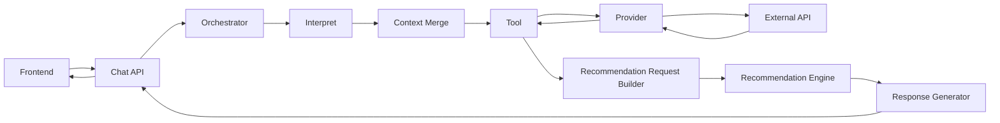

# TripBranch 아키텍처

## 1. 문서 목적과 상태

이 문서는 Phase 1-A의 목표 아키텍처와 현재 저장소 구현을 함께 설명합니다.
다이어그램의 일부 계층은 목표 구조이며 아직 코드로 존재하지 않습니다.

최종 확인: 2026-08-08.

| 구분 | 상태 |
| --- | --- |
| React Frontend | 구현됨 |
| 통합 Chat API (`POST /api/chat`) | 구현됨. 프론트 실사용 경로 |
| 분리된 Interpret/Recommendations API | 구현됨. 현재는 디버그 패널 전용 |
| Fake/Real Provider와 외부 API 연동 | 구현됨 |
| Interpret Orchestrator, Backend Context Merge, Agent Runtime 본체 | 구현됨 |
| Agent Runtime의 D 실제 추천 연결 | 구현됨 (D-033) |
| Tool | 위치·날씨·장소·장소 상세 단건·행사·집중률·공휴일 Tool 구현, 이동시간 등은 `TBD` |
| 가중치 Engine (Scoring v1) | 추천 파이프라인에 연결됨 |
| Recommendation Request Builder | 별도 계층으로는 미구현. 조건 결합은 파이프라인 내부에서 처리 |
| Fake/Real LLM Interpret | 구현됨 |
| Response Generator | 구현됨 (D-054). Rule 기반 조립 + 요약·GENERAL 답변에 LLM 호출 |
| Supabase Persistence — 장소 데이터 | 구현됨. 9개 테이블 운영 중 |
| Supabase Persistence — 세션 상태 | 구현됨. 단 기본값은 프로세스 내 메모리(`STATE_STORE_BACKEND=memory`) |

## 2. 전체 시스템 흐름

**프론트 실사용 경로는 `Frontend → POST /api/chat` 하나입니다.** 이 라우트가
`run_agent()`에 그대로 위임하고, Intent 분류부터 B/C/D 조정과 챗봇 메시지
조립까지가 한 번의 호출로 끝납니다.

`/api/interpret`과 `/api/recommendations`도 여전히 등록돼 있지만 현재는 개발용
디버그 패널(`IntentDebugPanel`, `AgentRuntimeDebugPanel`)이 호출합니다. 추천
API는 Geocoding·Weather·Place·Holiday를 수집하고 Scoring 후 상위 후보에
Concentration을 후조회합니다.

`Agent Runtime`은 A→B→C→D 전 구간에 실제 구현을 사용합니다. `run_agent()`의 기본
주입이 `RealRecommendationProvider`입니다(D-033). `services/runtime/stubs.py`의
Fake는 테스트에서 Provider를 갈아끼울 때만 씁니다.

## 3. 계층별 책임

### Frontend

- 담당: 사용자 입력, 메시지·추천 결과 렌더링, API 호출, UI 상태 관리
- 현재: `TripContext`와 `sessionStorage`에 같은 탭의 대화를 저장
- 하지 않음: LLM/외부 Provider 직접 호출, API 키 보관, 추천 점수 계산
- 세션 식별자는 Backend가 생성합니다. 프론트는 `/api/chat` 응답으로 받은
  `session_id`를 이후 발화에 실어 보냅니다

### Chat API

- 담당: 요청 검증, `run_agent()` 호출, 공개 응답 반환
- 하지 않음: Provider 원본 응답 직접 조작, 추천 점수 직접 계산
- 상태: `POST /api/chat`으로 구현됨(`routes/chat.py`). `/api/agent-debug`와 같은
  구현을 공유하되 용도가 다릅니다 — 전자가 실사용, 후자가 개발 패널 전용입니다
- 남은 것: 지금은 프론트 전환 비용을 줄이려고 `AgentResponse`를 그대로
  내보내므로 `llm_output` 전체와 B의 내부 state까지 공개 계약에 노출됩니다.
  필요한 필드만 남기는 축소는 D-016 확정 대기 중입니다(`routes/chat.py` TODO)

### Orchestrator

- 담당: Intent에 따른 실행 순서, Tool 호출, fallback, 실행 ID 및 로그 연결
- 하지 않음: 외부 API별 필드 파싱, 도메인 점수식 자체 구현
- 상태: Interpret Orchestrator와 `Agent Runtime` 본체 구현. A→B→C→D 전 구간이
  실제 구현으로 연결됐고, `/api/chat`·`/api/agent-debug` 두 라우트가
  `run_agent()`를 호출합니다

### Interpret

- 담당: 자연어에서 Intent와 명시 조건·변경 조건을 구조화
- 하지 않음: 최종 추천 장소 결정, 외부 API 사실을 추측, 점수 계산
- 현재: Fake/Real LLM Provider를 선택하고 Intent별 구조화 결과를 반환

### Context Merge

- 담당: 현재 발화에서 추출한 변경분을 이전 조건 및 현재 장소 맥락과 병합
- 하지 않음: 과거의 날씨·운영정보 스냅샷을 현재 사실로 간주
- 상태: Backend State Service에 Add/Update/Remove/Keep 병합과 세션 이력 구현

### Tool

- 담당: 추천 파이프라인이 사용하는 업무 단위 기능 제공
- 하지 않음: 특정 외부 API 응답 형식을 호출자에게 노출
- 구현된 Tool (`backend/app/tools/`)

  | Tool | 용도 |
  | --- | --- |
  | `ResolveLocationTool` | 위치 해석 |
  | `NearbyPlaceDetailsTool` | 좌표 주변 후보 검색 + 상세 보강 |
  | `GetPlaceDetailTool` | 이미 특정된 장소 1건의 상세 조회 (D-054) |
  | `GetFestivalsTool` | 지역 행사 중 기준일에 진행 중인 것 (D-055) |
  | `GetWeatherForecastTool` | 방문 시각 초단기예보 |
  | `GetConcentrationTool` | 집중률 예측 |
  | `GetHolidaysTool` | 공휴일 |

- 미구현: 이동시간(`estimate_travel_time`), 블로그 근거
  (`search_place_feature_evidence`)

### Provider

- 담당: 외부 API 호출, 인증, timeout, 응답 파싱, 내부 모델 정규화
- 하지 않음: 사용자 의도 판단, 추천 정책 결정
- 현재: Geocoding, LocalSearch, Weather, Place, Festival, Concentration,
  Holiday의 Fake/Real 구현 존재. 상세는
  [Provider Contract v1](../backend/docs/provider-contract-v1.md)
- Real 실패 시 Fake로 자동 전환하지 않습니다(D-042). 실패는 첫 요청이 아니라
  부팅에서 드러나야 하므로 `validate_provider_config()`가 기동 시 검사합니다

### Recommendation Request Builder

- 담당: 병합된 조건을 검증하고 Provider/Tool 결과를 결합해 내부
  `RecommendationRequest` 생성
- 하지 않음: 프론트 공개 계약으로 노출, 원문 발화를 그대로 점수기로 전달
- 상태: 독립 계층으로는 미구현. 조건 결합은
  `services/recommendation_pipeline.py`와 `agent_context/`가 나눠 처리하고
  있으며, 별도 Builder를 세울지는 결정되지 않았습니다

### Recommendation Engine

- 담당: 명시적 필수 조건의 하드 필터, Feature 계산, 가중치 점수, 결정적 정렬,
  이전 노출·거절 장소 제외
- 현재: `backend/app/domain/scoring.py::score_candidates()`로 날씨·남은 운영
  시간·거리 Feature 가중치 점수와 결정적 정렬(Scoring v1)을 독립 모듈로 구현.
  카테고리는 1차 하드 필터가 처리한다고 보고 가중치에서 제외했고, 운영 유무는
  가중치 Feature가 아니라 `now`와 `OperatingHours`를 비교하는 최종 하드
  필터로 판정. 이전 노출·거절 ID 하드 필터, 운영시간 미확인과 폐점의 구분,
  날씨·남은 운영시간 결측 시(후보별로 독립적일 수 있는) 가중치 재분배 포함.
  상세는 [추천 점수 설계](./design/recommendation-scoring.md) 참고
- 추가: `backend/app/domain/evidence.py::build_evidence_list()`로
  `RankedCandidate`를 Feature별 기여도(score × weight) 중심의
  `RecommendationEvidence`로 변환하고, 반복 검증 가능한 고정 평가
  Fixture v1(`backend/tests/fixtures/scoring_fixture_v1.py`)을 구축(D-027).
  자연어 문장은 만들지 않으며 상세는
  [추천 Evidence·평가 Fixture 설계](./design/recommendation-evidence-fixture.md) 참고
- 연결: `backend/app/services/recommendation_pipeline.py`가
  `/api/recommendations` 라우트까지 실제로 연결돼 있으며,
  `_build_response()`가 `build_evidence()`를 호출해 `RecommendationItem`에
  `score`/`feature_scores`/`weights_used`를 노출한다(D-028). 재사용 가능한
  파이프라인 레벨 Fixture(`backend/tests/fixtures/recommendation_pipeline_fixture_v1.py`)와
  날씨 유무·결정성 E2E 테스트로 검증됨
- 미구현: 혼잡도·근거 신뢰도 Feature, 실이동시간 거리

### Explainability Layer

- 담당: `RecommendationEvidence`의 Feature별 기여도를 Rule 기반·결정적으로
  한국어 문장으로 변환 (LLM 미사용)
- 하지 않음: 추천 순위 재결정, 애매하거나(0.4~0.7) 낮은(<0.4) Feature 점수에
  대한 부정적 근거 문장 생성, 자연어 다듬기/요약(Response Generator 영역)
- 상태: `Accepted`(D-029). `backend/app/domain/explanation.py::
  build_explanations()`가 Feature 점수 0.7 이상인 것만 기여도 순으로
  `RecommendationItem.explanations`에 노출. A(Agent Runtime) 담당과 API
  Contract 협의 반영 완료 — 상세 설계는
  [추천 Explainability Layer 설계](./design/recommendation-explainability.md)
- 추가(D-030): 날씨 결측·전체 Feature 임계값 미달로 `explanations`가 조용히
  비거나 줄어드는 두 케이스를 `warnings` 문구로 보완. 운영시간 결측만큼
  심각한 불확실성은 아니라고 판단해 `unverified_recommendations` 분리는
  적용하지 않음. 상세는 `docs/decision-log.md`의 D-030 참고

### Response Generator

- 담당: 추천 결과와 근거·경고를 사용자에게 읽기 쉬운 자연어로 변환
- 하지 않음: 추천 순위 재결정 또는 검증되지 않은 사실 생성
- 상태: 구현됨(`services/runtime/response_composer.py`, D-054). 두 계층입니다.
  - `compose_recommendation_message()` — 장소 카드 1건의 문장. D가 만든
    `explanations`/`warnings`를 협의된 순서(근거 먼저, 경고는 "다만~"으로
    마지막)로 이어붙이며 **문장 내용은 재작문하지 않습니다**
  - `compose_chat_message()` — 카드를 감싸는 말풍선(`AgentResponse.message`).
    Intent/status별 고정 템플릿을 고르되, GENERAL 답변과 RECOMMEND/MODIFY 추천
    요약에는 LLM(트리비 페르소나)을 호출합니다. 요약 입력에서 내부 scoring
    필드는 제외합니다
- 상세는 [Agent 응답 생성 설계](./design/agent-response-generation.md) 참고

### Persistence / Supabase

- 담당 목표: 세션 메타데이터, 정규화 조건, 추천 실행·결과·외부 데이터 스냅샷 저장
- 사용자 자연어 원문은 영구 저장하지 않는 것이 원칙
- 현재 9개 테이블이 운영 중이며 세 그룹으로 나뉩니다.

  | 그룹 | 테이블 | 소유 |
  | --- | --- | --- |
  | 장소 데이터 | `places`, `place_enrichments`, `place_concentration_mappings` | C |
  | 동기화 관리 | `place_sync_runs`, `place_sync_locks` | C |
  | 세션 상태 | `agent_states`, `condition_change_logs`, `recommendation_histories`, `trace_records` | B |

- 장소 영역 스키마는
  [장소 데이터베이스 설계](./design/place-database-schema.md), 세션 상태는
  [Agent State Contract v1](../backend/docs/package-b/agent-state-contract-v1.md)
- **연동 코드가 있다는 것과 기본으로 쓴다는 것은 다릅니다.**
  - 세션 상태: `SupabaseStateStore`가 있으나 기본값은 프로세스 내 메모리입니다
    (`STATE_STORE_BACKEND=memory`). Supabase로 붙이려면 명시 설정이 필요합니다
  - 장소 상세: 기본값이 `PLACE_DETAILS_SOURCE=tour_api`라 요청 시점에 TourAPI를
    호출합니다. `supabase`로 두면 사전 동기화한 `places`에서 일괄 조회합니다
- 보존기간과 접근정책: RLS는 활성화돼 있고 `anon`/`authenticated`에 직접 쓰기
  정책을 두지 않습니다. 보존기간은 `TBD`

### localStorage

- 목표: 채팅 복원용 사용자 원문과 표시 메시지를 브라우저에 저장 가능
- 서버 영속 데이터와 달리 사용자 기기 범위의 UI 상태로 취급
- 현재 구현은 `localStorage`가 아니라 버전 2의 `sessionStorage`를 사용함
- 전환 여부와 만료/삭제 정책: 현재 논의 중

## 4. 주요 경계

### Interpret와 Recommendation

Interpret는 “사용자가 무엇을 원하는가”를 조건으로 추출합니다. Recommendation은
검증·병합·외부 데이터 보완이 끝난 조건을 사용해 장소를 평가합니다. Interpret가
장소를 직접 고르면 외부 사실 검증과 결정적 점수 정책을 우회하므로 금지합니다.

### Provider와 Tool

Provider는 TourAPI나 기상청처럼 외부 시스템과 직접 통신합니다. Tool은
`get_place_details`처럼 업무 목적을 표현하며 하나 이상의 Provider 호출을 조합할 수
있습니다. 두 계층은 외부 엔드포인트와 1:1일 필요가 없습니다.

### 외부 응답과 추천 모델

Provider 응답 필드는 서비스마다 이름, 누락 규칙, 자료형이 다릅니다. 추천기가
원본 응답을 직접 사용하면 Provider 변경이 점수 로직 전체로 전파됩니다. 따라서
Provider/Mapper가 `PlaceCandidate`, `PlaceDetails`, `WeatherCondition` 등의 내부
모델로 정규화하고 원본은 진단용 `raw_*` 필드로만 보존합니다.

### 사용자 발화와 추천 계산 입력

자연어에는 생략, 모호성, 이전 턴 참조가 포함됩니다. 추천 계산 입력은 단위·기본값·
출처·신뢰도가 확정된 값이어야 하므로, 원문과 `RecommendationRequest`를 분리합니다.

### 프론트와 백엔드 상태

- Frontend: 입력 중 상태, 렌더링 메시지, 로컬 복원 데이터
- Backend: 정규화 조건, 실행 상태, 외부 데이터 스냅샷, 추천 결과와 로그
- 현재 Backend는 기본 설정에서 프로세스 내 State Store에 세션 조건·이력을
  저장합니다. Supabase 영속화 구현체(`state/supabase_store.py`)는 있으나
  `STATE_STORE_BACKEND=supabase`일 때만 쓰입니다. Frontend는 `sessionStorage`를
  사용합니다.

### 식별자 생성 위치

- `session_id`와 `run_id`는 Backend State Service가 생성합니다.
- `POST /api/chat`은 `session_id`를 선택 필드로 받습니다. 없으면 Backend가
  새로 만들고, 프론트는 응답으로 받은 값을 이후 발화에 실어 보냅니다.
- 초기 설계의 `chat_session_id`라는 별도 식별자는 도입하지 않았고 `session_id`로
  일원화했습니다.
- `recommendation_run_id`에 해당하는 현재 `run_id`는 추천 실행·상태 변경을 연결합니다.
- 세션 ID는 사용자 인증 ID가 아닙니다.

## 5. 외부 데이터 스냅샷

과거 채팅을 열 때는 당시 추천 판단에 사용한 날씨·운영정보·혼잡도·추천 결과를
스냅샷으로 표시합니다. 과거 대화를 단순 열람하는 행위는 Provider 재호출을 유발하지
않고, 사용자가 후속 입력을 보낼 때만 현재 데이터를 새로 조회하는 방향입니다.
구체 저장 스키마와 TTL은 `TBD`입니다.

### Weather 기준시각

MVP의 Weather 판단은 현재 관측값이 아니라 방문 예정 시각에 가까운 기상청
초단기예보를 사용합니다.

- 즉시 방문: 현재 시각과 가장 가까운 예보
- 일정 기반 방문: 방문 예정 시각과 가장 가까운 예보
- 현재 관측 날씨는 MVP 필수 범위에서 제외
- 관측값이 추가되더라도 가까운 시간대 판단을 보완하며 방문 시각 예보가 우선
- 품질 검증에서 즉시 추천이 부족하다고 확인될 때만 관측 API 추가 검토

Weather Snapshot은 `data_type=forecast`, `retrieved_at`, `forecast_for`,
`observed_at=null`을 보존합니다. `GetWeatherForecastTool`은 즉시 방문 또는
명시적인 방문 예정 시각에 가장 가까운 예보를 선택하며 Snapshot 저장은
미구현입니다.

## 6. 오류와 fallback 방향

| 상황 | 기본 방향 | 확정 상태 |
| --- | --- | --- |
| Geocoding 실패 | 위치 재입력 요청; 추천 실행 중단 | 부분 구현 |
| Place 후보 조회 실패 | `unavailable`로 추천 실행 중단 | 구현됨 |
| Weather 실패 | 날씨 Feature 제외 후 나머지 가중치 재정규화 | 구현됨 |
| 운영시간 누락 | 제외 또는 `unverified_recommendations`로 분리 | 현재는 분리 |
| Concentration 실패 | 순위 확정 후 후조회만 생략하고 기존 추천 유지 | 구현됨 |
| Blog 근거 실패 | 분위기/조용함 Feature를 미확인 처리 | 제안, `TBD` |
| 하드 필터 후 후보 없음 | 완화 가능한 조건을 설명하고 사용자 확인 요청 | `TBD` |
| LLM 실패 | 같은 벤더 내 대체 모델로 fallback 후 재시도 | 구현됨 (D-052, `LLM_FALLBACK_MODEL_NAMES`) |

전체 실패와 부분 추천의 기준은 다음 원칙으로 구분합니다.

- 위치와 장소 후보처럼 추천 실행에 필수인 데이터 실패는 실행 실패
- 날씨·혼잡도·블로그 근거처럼 선택 Feature 실패는 해당 Feature만 제외 가능
- 사용자가 명시한 필수 조건은 자동 완화하지 않고 확인 요청
- 부분 추천에는 누락된 검증 항목과 경고를 함께 표시

로그 후보 항목은 `recommendation_run_id`, Provider/Tool 이름, 시작·종료 시각,
성공 여부, 표준 오류 코드, latency, fallback 여부, 후보 수 변화입니다. API 키,
사용자 원문, 인증 헤더 및 전체 민감 응답은 기록하지 않습니다. 구체 로그 스키마와
보존기간은 `TBD`입니다.

### Tool 오류 경계

Tool 공통 오류 code는 `invalid_input`, `not_found`, `no_data`, `unavailable`,
`unsupported`, `internal_error`로 확정합니다.

- `no_data`: 호출과 파싱은 성공했으며 요청 조건에 데이터가 없음을 확인
- `unavailable`: timeout, 인증, 네트워크, 파싱 오류 등으로 존재 여부 확인 실패
- timeout·인증·rate limit은 `unavailable`의 `cause`로 표현
- Provider 실패는 `ProviderError(source, code, cause, occurred_at, retryable)`로
  표현하고 ToolError 변환 시 해당 진단정보를 보존
- 정상 데이터의 `retrieved_at`과 오류 감지 시각 `occurred_at`을 구분
- Tool은 오류를 분류하고 Orchestrator가 중단·부분 진행·재질문을 결정
- 선택 Feature의 `no_data`/`unavailable`은 warning과 함께 제외할 수 있음
- 위치와 장소 후보 같은 필수 데이터의 오류는 추천 실행을 중단하거나 사용자에게
  조건 수정을 요청

세부 `ToolResult<T>` 및 매핑표는 [API 계약](./api-contracts.md)을 따릅니다.
