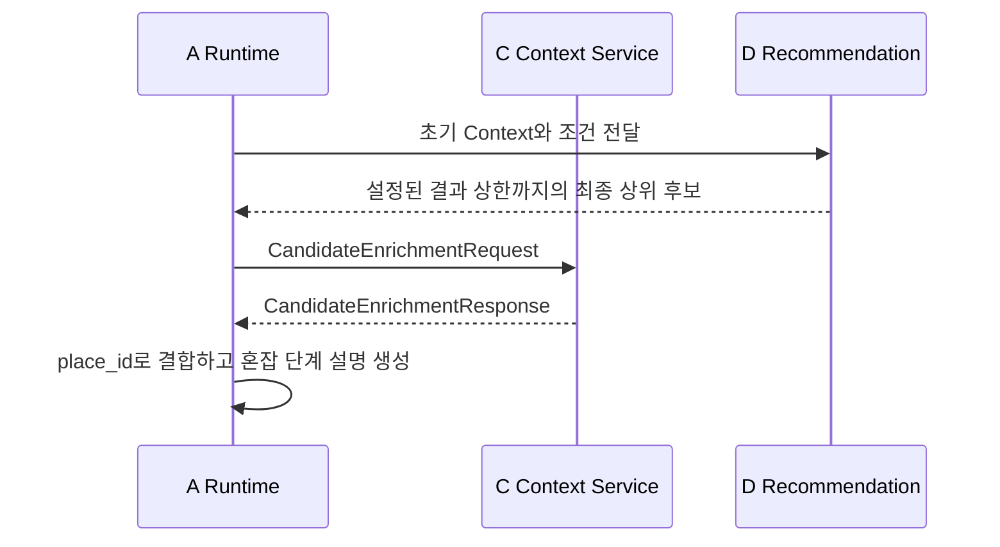

# A ↔ C Context Contract 초안

## 1. 목적

A(Agent Runtime)가 LLM에서 추출한 사용자 조건을 C(Tool Intelligence)에 전달하면,
C가 필요한 내부 Tool과 Provider를 선택해 추천에 필요한 공통 Context를 반환한다.

이 문서는 **협의용 초안**이다. 추천 점수 계산과 사용자용 자연어 응답 생성은 이
계약의 범위가 아니다.

## 2. 책임 경계

| A가 전달하는 것 | C가 결정하는 것 |
| --- | --- |
| 사용자 Intent와 LLM 추출 조건 | 사용할 Tool과 Provider |
| 요청 추적용 `request_id` | API 호출 순서·재시도·정규화 |
|  | Provider 원본 응답을 공통 Context로 변환 |

A는 Provider 이름, API endpoint, API Key, TourAPI 분류 코드, Provider별 원본
필드를 전달하지 않는다. C는 `chat_session_id`를 받거나 저장하지 않는다.

`request_id`는 A가 C 호출마다 생성하는 ID이며, 채팅 세션 ID나 사용자 메시지 ID를
대체하지 않는다.

C는 외부 데이터 조회와 정규화만 담당하며, 이전 노출·거절 후보 제외, 하드 필터,
점수 계산, 최종 추천 개수 결정은 D Recommendation의 책임이다.

다만 A는 소진분(`excluded_place_ids`)을 C에도 함께 전달한다. 이는 위 원칙의
예외가 아니라 **수집 범위 결정에 필요한 입력**이다 — 장소 검색이 거리순 고정
정렬이라, C가 소진분을 모르면 같은 조건에 매번 같은 앞쪽 N건을 돌려주고 D가
그걸 전부 제외해 추천이 0건이 된다. C는 이 목록으로 "추천할지 말지"를 판정하지
않고 "몇 건을 더 받아올지"만 정한다. 판정은 여전히 D에서 한 번만 일어난다.

## 3. 범위와 확장 원칙

v0는 `RECOMMEND`의 추천 Context 수집만 다룬다. `INFO`와 `COMPARE`는 대상 장소
식별·추천 스냅샷 계약이 추가로 필요하므로 후속 협의 대상으로 둔다.

기존 `tool-intelligence-contract-v1.md`의 `ToolRequest`는 A가 `tool_type`을
선택하는 형식이다. 이 초안은 A가 Tool을 선택하지 않는 상위 A↔C 호출 계약이다.
C 내부에서는 기존 Tool 계약을 계속 사용할 수 있다.

외부 호출 창구는 하나로 유지한다. 이후 Intent가 추가되어도 공통 envelope
(`request_id`, `intent`, `conditions` 또는 Intent별 payload)는 유지하고,
`intent`를 discriminator로 하는 Pydantic union에 요청·응답 모델만 추가한다.

```python
from typing import Annotated

from pydantic import Field


AgentToCRequest = Annotated[
    RecommendContextRequest
    | InfoContextRequest
    | CompareContextRequest,
    Field(discriminator="intent"),
]
```

이 방식은 새 Intent 추가 시 기존 `RECOMMEND` 요청·응답 필드를 바꾸지 않도록 한다.
다만 새 Intent 자체의 payload 모델과 C 처리 로직은 추가해야 한다.

## 4. A → C 요청

### 4.1 스키마

```python
from typing import Literal

from pydantic import BaseModel, Field


class UserConditions(BaseModel):
    current_location: str | None = None
    search_center: str | None = None
    place_types: list[str] = Field(default_factory=list)
    place_tags: list[str] = Field(default_factory=list)
    weather: Literal["rain", "snow", "hot", "cold", "good"] | None = None
    weather_intent: Literal["AVOID", "ENJOY", "NO_MENTION", "IGNORE"] | None = None
    transport: Literal["walk", "public", "car"] | None = None
    max_travel_time: int | None = None
    time_available: int | None = None
    environment: Literal["indoor", "outdoor", "any"] | None = None
    companion: Literal["solo", "couple", "friend", "parent", "child", "pet"] | None = None
    budget: str | None = None
    exclude_tags: list[str] = Field(default_factory=list)
    special_requirements: list[str] = Field(default_factory=list)


class AgentContextRequest(BaseModel):
    request_id: str
    intent: Literal["RECOMMEND"]
    conditions: UserConditions
    gps_location: Coordinates | None = None
    excluded_place_ids: list[str] = Field(default_factory=list)
    resolved_search_center: Coordinates | None = None
```

### 4.2 필드 설명

| 필드 | 필수 | 설명 |
| --- | --- | --- |
| `request_id` | 예 | A가 호출 1건마다 생성하는 추적 ID. 응답에 그대로 반환된다. |
| `intent` | 예 | v0에서는 항상 `RECOMMEND`. C가 필요한 Context 수집 흐름을 선택하는 기준이다. |
| `conditions` | 예 | LLM이 추출한 사용자 조건. A는 값을 임의로 Provider 형식으로 변환하지 않는다. |
| `gps_location` | 아니오 | A가 전달하는 기기 GPS 좌표. 사용자 발화 위치와 분리한다. 장소명이 없으면 검색 중심 fallback으로 쓴다. 사용자 위치(`context.user_location`)로는 `conditions.current_location`이 우선하고, 이 값은 발화 위치가 없거나 해석에 실패했을 때 쓰인다(TP-112). |
| `excluded_place_ids` | 아니오 | 이미 소진된 후보 id(노출분 ∪ 거절분). C는 이걸로 추천 여부를 판정하지 않고, 그만큼 후보를 더 받아와 새 후보가 요청 개수만큼 남게 하는 데만 쓴다. 2절의 "제외 판정은 D 책임"은 그대로다 — 아래 설명 참고. |
| `resolved_search_center` | 아니오 | 같은 턴 안의 **보충 조회**에서만 채운다. A가 첫 조회에서 확정한 검색 기준점 좌표다. 값이 있으면 C는 장소만 다시 주고 위치 해석·날씨·공휴일을 건너뛴다 — 그 셋의 결과는 A가 보충 배치에서 버리기 때문이다(첫 배치 값을 그대로 쓴다). 보충 1회의 외부 호출이 7건에서 2건으로 준다. 값이 없으면 기존과 동일하게 전부 수집한다. |
| `current_location` | 아니오 | 사용자가 말한 현재 위치. |
| `search_center` | 아니오 | 추천 검색 중심 장소. |
| `place_types`, `place_tags` | 아니오 | 사용자가 원하는 장소 유형·태그. C가 내부 분류 코드로 변환한다. |
| 나머지 조건 | 아니오 | 날씨 선호, 이동, 시간, 환경, 동행, 예산 등 추천 판단에 필요한 사용자 조건. |

### 4.3 요청 예시

```json
{
  "request_id": "req_01JABC",
  "intent": "RECOMMEND",
  "gps_location": {"latitude": 37.5796, "longitude": 126.9770},
  "conditions": {
    "current_location": "경복궁",
    "search_center": null,
    "place_types": ["restaurant"],
    "place_tags": ["카페"],
    "weather": null,
    "weather_intent": "AVOID",
    "transport": "walk",
    "max_travel_time": 20,
    "time_available": 120,
    "environment": "indoor",
    "companion": "friend",
    "budget": null,
    "exclude_tags": [],
    "special_requirements": []
  }
}
```

### 4.4 요청 결측 규칙

- 사용자가 언급하지 않은 단일 조건은 `null`을 허용한다.
- `gps_location`은 선택 필드다. 이번 요청의 유효한 기기 GPS를 우선하고, 없으면 B에 저장된 만료되지 않은 GPS를 사용한다. 둘 다 없으면 `null`이다.
- `search_center`와 `current_location`은 사용자 발화에서 추출한 장소명이고, `gps_location`은 기기 좌표이므로 서로 대체 저장하지 않는다.
- 복수 조건은 빈 배열 `[]`을 허용한다.
- 빈 문자열과 공백 문자열은 허용하지 않는다.
- `current_location`과 `search_center`가 모두 `null`이면 요청 형식 오류가 아니라,
  C가 `needs_clarification`으로 반환한다.

## 5. C → A 응답

### 5.1 스키마

```python
from __future__ import annotations

from datetime import datetime
from typing import Generic, Literal, TypeVar

from pydantic import BaseModel, Field

class AgentContextResponse(BaseModel):
    request_id: str
    intent: Literal["RECOMMEND"]
    contract_version: Literal["draft-v0"]
    status: Literal[
        "success", "partial", "no_data", "needs_clarification", "unsupported", "unavailable"
    ]
    context: RecommendationContext | None = None
    clarification: Clarification | None = None
    warnings: list[Warning] = Field(default_factory=list)
    error: ContextError | None = None
    metadata: ResponseMetadata


class Coordinates(BaseModel):
    latitude: float
    longitude: float


class ProviderMetadata(BaseModel):
    source: str
    status: Literal["success", "no_data", "unavailable"]
    retrieved_at: datetime


class Warning(BaseModel):
    code: str
    message: str


class ContextError(BaseModel):
    code: str
    message: str
    retryable: bool


class Clarification(BaseModel):
    code: Literal[
        "location_required",
        "location_ambiguous",
        "place_required",
        "place_ambiguous",
    ]
    missing_fields: list[str] = Field(default_factory=list)
    candidates: list[str] = Field(default_factory=list)


class ResolvedLocation(BaseModel):
    # 사용자가 말한 문자열(수식어 제거 후). 근거 문장이 기준점을 부를 때 쓰는 값이다 —
    # resolved_name은 지오코딩으로 풀리면 도로명 주소가 되므로 표시용으로 쓸 수 없다.
    requested_query: str
    resolved_name: str
    # 이 좌표의 출처. "query"면 requested_query가 사용자가 말한 장소이고,
    # "device_gps"면 기기 위치라 부를 이름이 없다(requested_query는 자리표시자).
    source: Literal["query", "device_gps"]
    location: Coordinates
    address: str | None = None


class WeatherForecast(BaseModel):
    forecast_for: datetime
    # D-051: 판정 없는 날씨 "사실"만 싣는다. 기상청 코드(SKY/PTY)를 그대로
    # 넘기지 않고 C가 도메인 용어로 옮긴다 — 코드 체계가 D까지 새면 기상 API를
    # 바꿀 때 D도 함께 고쳐야 한다.
    precipitation: Literal["none", "rain", "snow", "sleet", "shower"] | None = None
    sky: Literal["clear", "cloudy", "overcast"] | None = None
    temperature_celsius: float | None = None


class PlaceCandidate(BaseModel):
    place_id: str
    name: str
    category: str
    location: Coordinates
    operating_hours_raw: str | None = None
    rest_date_raw: str | None = None
    operating_schedule: dict[str, object] | None = None


class HolidayInfo(BaseModel):
    date: str
    name: str


# (제안, C 확인 필요 — concentration-conditions.md §2.2/§4)
# concentration_intent가 AVOID/SEEK일 때만 채워지는 지역 단위 집중률 목록.
# 후보별이 아니라 지역(종로구) 전체 관광지 예측치이며, A가 place_name으로
# places와 매칭한다.
class ConcentrationEntry(BaseModel):
    place_name: str
    forecast_date: str
    concentration_rate: float
    concentration_level: Literal["quiet", "normal", "slightly_crowded", "crowded"]
    concentration_label: str


T = TypeVar("T")


class ContextValue(BaseModel, Generic[T]):
    status: Literal["success", "no_data", "partial", "unsupported", "unavailable"]
    data: T | None = None
    error: ContextError | None = None
    warnings: list[Warning] = Field(default_factory=list)
    provider_metadata: list[ProviderMetadata] = Field(default_factory=list)


class RecommendationContext(BaseModel):
    # 반경 검색으로 후보를 **모은** 중심. 사용자가 있는 곳이 아니라 "이번 검색을
    # 어디를 중심으로 했는가"다. search_center → current_location → 기기 GPS 순.
    # 후보를 **줄 세우는** 기준점은 user_location이다(TP-112, D-067).
    location: ContextValue[ResolvedLocation] | None = None
    # 사용자가 있는 곳. 기준점(location)이 따로 잡혀도 버리지 않는다.
    # current_location(발화) → 기기 GPS 순으로 정해진다 — location의
    # search_center → current_location → GPS와 같은 우선순위다(TP-112).
    # location과 같은 타입이라 D는 기준점에 쓰던 판정을 그대로 쓸 수 있다.
    user_location: ContextValue[ResolvedLocation] | None = None
    weather: ContextValue[WeatherForecast] | None = None
    places: ContextValue[list[PlaceCandidate]] | None = None
    holidays: ContextValue[list[HolidayInfo]] | None = None
    # (제안, C 확인 필요) conditions.concentration_intent가 AVOID/SEEK일 때만 채움
    concentration: ContextValue[list[ConcentrationEntry]] | None = None


class ResponseMetadata(BaseModel):
    rule_versions: dict[str, str] = Field(default_factory=dict)
    provider_metadata: list[ProviderMetadata] = Field(default_factory=list)


```

### 5.2 Context 데이터 개요

| Context | C가 반환하는 내용 | D Recommendation의 사용 예 |
| --- | --- | --- |
| `location` | 해석된 장소명·좌표·주소 | 검색 중심과 거리 계산 기준 |
| `weather` | 예보 시각과 날씨 사실(`precipitation`/`sky`/`temperature_celsius`) | 사용자 의도와 합쳐 3종 판정을 내린 뒤 날씨 Feature 계산 |
| `places` | 후보 장소, 좌표, 분류, 원본·정규화 운영정보 | Candidate 생성·운영시간·거리 계산 |
| `holidays` | 해당 시점의 공휴일 정보 | 후속 운영 판단 보조. v0 점수 반영은 TBD |
| `concentration` (제안, C 확인 필요) | `conditions.concentration_intent`가 `AVOID`/`SEEK`일 때만, 지역(종로구) 단위 관광지 집중률 목록 | Scoring `concentration` Feature 계산 — **순위에 반영됨** ([recommendation-scoring.md §4.4](./recommendation-scoring.md), A 제안) |

**(2026-07-29 추가, 제안 — C 확인 필요)** `concentration_intent`가 `AVOID`/`SEEK`이면
`concentration`도 이 초기 응답에 함께 채워 반환한다. 후보별로 별도 조회하지 않고
지역 코드 1회 호출로 해당 지역 관광지 전체의 예측치를 받아온다(place_name 생략,
[tool-intelligence-contract-v1.md §6.5](./tool-intelligence-contract-v1.md#65-get_concentration)).
A는 `places`의 각 후보 이름과 `concentration` 목록을 매칭해 D의 Scoring 입력으로
쓴다. 이 경로로 받은 값은 **순위에 반영된다** — 아래 §5.2.1~§5.2.3이 설명하는
후보 보강(post-ranking, 표시 전용) 경로와는 별개다. 상세 배경은
[concentration-conditions.md §2.2](./concentration-conditions.md#22-데이터-확보-시점--재검토-중-2026-07-30-c-협의-완료--d-미확인-최종-확정-아님)
참고.

> **🔶 2026-07-30 재검토(제안, C 협의 완료 / D 미확인)**: 위 `concentration`
> 필드 확장안은 세션 중 실측(장소 검색 ~3.0초, 지역 전체 집중률 병렬 ~3.5초·
> 순차 ~11.8초 vs 개별 조회 ~0.12초)으로 이득이 없다고 판단돼 재검토 중이다.
> 대안으로 **바로 아래 §5.2.1~§5.2.3의 기존 후보 보강 계약을 그대로
> 재사용**하는 안이 새로 제안됐다 — 이 필드 자체는 삭제하지 않지만, 실제
> 채택될지는 불확실하다(두 안 중 택1, D 확인 필요). 상세는
> [concentration-conditions.md §2.2.3](./concentration-conditions.md#223-제안-흐름--9단계-c-협의됨--d-미확인).

---

**(2026-07-30 재검토, 문구 정정)** 아래 §5.2.1~§5.2.3의 후보 보강 계약은 원래
"D가 1차 점수 계산을 이미 마친 뒤 상위 후보만 골라 표시용 정보를 덧붙이는
용도"(§5.2.3)로 설계됐고, v0.4 시점엔 `concentration_intent` 경로가 이 계약을
쓰지 않는다고 판단했었다. **이 판단은 2026-07-30 재검토 중이다** — 실측 성능
결과로 "1차 Scoring(10개, concentration 없음) → 상위 5개 → 그 5개만 이 계약으로
보강 조회 → 2차 Scoring(5개+concentration)" 안이 새로 제안되면서, 오히려 **이
계약을 그대로 재사용하는 쪽으로 방향이 다시 옮겨가고 있다**(C 협의 완료, D
미확인 — D의 2차 Scoring 신규 인터페이스가 확정돼야 최종적으로 성립한다). 이
계약 자체는 애초에 폐기한 적 없다 — "순위에는 반영하지 않는 표시 전용 보강"
용도와 "순위에 반영되는 재채점" 용도, 두 가지로 쓰일 가능성이 생긴 상태다.

**A가 이 계약을 호출하는 순서 (제안, C 협의됨)**: (1) D의 1차 Scoring 결과
(`RankedCandidate`, `place_id`/`name`만 있고 위도·경도 없음)를 원본 `places`
Context(위도·경도 있음)와 `place_id`로 재조인해서 아래 `CandidateEnrichmentTarget`
리스트를 구성 → (2) `CandidateEnrichmentRequest`를 만들어 `enrich()` 호출 → (3)
받은 `CandidateEnrichmentResponse`를 D의 2차 Scoring 입력으로 변환(D 인터페이스
확정 후 설계). 상세는 [agent-runtime-contract.md §6.5.2](./agent-runtime-contract.md).

**참고 (신규 발견, 런타임 미연결)**: develop 병합(2026-07-30)으로 C가 이미
`place_id` ↔ 집중률 API 대표명을 매핑해두는 `place_concentration_mappings`
테이블을 구축해뒀다([concentration-conditions.md §4.4](./concentration-conditions.md#44-place_concentration_mappings--c-기존-인프라-신규-발견-런타임-미연결)).
이 계약의 `place_name` 매칭에 활용할 수 있는 기존 인프라이지만, 아직
`enrichment_service.py`에는 연결돼 있지 않다 — 연결 여부는 C 확인 필요.

후보 보강 계약은 초기 Context 계약과 분리된
`CandidateEnrichmentRequest`/`CandidateEnrichmentResponse`를 사용한다. 요청은
D가 선정하고 A가 중계한 후보를 `RECOMMENDATION_RESULT_LIMIT`만큼 받으며
(기본 5개, 시스템 절대 상한 20개), v1 지원 Feature는
`concentration` 하나다. C는 요청 순서를 유지하고 후보별
`success`/`no_data`/`unavailable`과 Provider metadata를 반환한다. 일부 후보만
성공하거나 실패하면 전체 상태는 `partial`이며, 실패 후보도 목록에서 제거하지 않는다.

방문일을 별도로 받지 않는 v1에서는 C가 집중률 API를 호출한 시점의 한국 날짜를
기준일로 사용한다. 여러 날짜가 반환되더라도 오늘 날짜와 일치하는 유효한 값만
`YYYY-MM-DD` 형식으로 정규화해 최대 한 건짜리 `concentration` 목록으로 반환한다.
오늘 값이 없으면 미래나 과거 값으로 대체하지 않고 후보 상태를 `no_data`로 반환한다.

오늘 집중률에는 원본 상대 비율과 정규화된 단계·표시명을 함께 포함한다.
임계값과 단계 정의는 C의 `app/concentration_policy.py`를 단일 기준으로 사용한다.

| 집중률 범위 | `concentration_level` | `concentration_label` |
| --- | --- | --- |
| 20% 미만 | `quiet` | 한적함 |
| 20% 이상 50% 미만 | `normal` | 보통 |
| 50% 이상 70% 미만 | `slightly_crowded` | 다소 혼잡 |
| 70% 이상 | `crowded` | 혼잡 |

음수·무한대·숫자 변환 불가 값은 `no_data`로 처리한다. 이 단계는 사용자 설명을 위한
정규화이며 추천 점수를 다시 계산하거나 후보 순서를 변경하지 않는다.

#### 5.2.1 A → C 후보 보강 재요청

D는 1차 점수 계산 후 보강할 상위 후보를 `RECOMMENDATION_RESULT_LIMIT`까지 A에
반환한다. A는 Provider나 지역 코드를 선택하지 않고 후보 식별정보와 필요한
Feature만 C에 전달한다.

```python
from app.agent_context.enrichment_schemas import (
    CandidateEnrichmentRequest,
    CandidateEnrichmentTarget,
)


enrichment_request = CandidateEnrichmentRequest(
    request_id=new_trace_id(),
    candidates=[
        CandidateEnrichmentTarget(
            place_id=candidate.place_id,
            name=candidate.name,
            latitude=candidate.latitude,
            longitude=candidate.longitude,
        )
        for candidate in top_candidates[:5]
    ],
    features=["concentration"],
)

enrichment_response = await enrichment_provider.enrich(enrichment_request)
```

```json
{
  "request_id": "enrich-01",
  "candidates": [
    {
      "place_id": "126508",
      "name": "경복궁",
      "latitude": 37.5796,
      "longitude": 126.977
    },
    {
      "place_id": "125759",
      "name": "창덕궁",
      "latitude": 37.5794,
      "longitude": 126.991
    }
  ],
  "features": ["concentration"]
}
```

`request_id`는 A가 재요청마다 새로 생성한다. 초기 Context 요청 ID 또는 추천 실행
ID와 로그에서 연관 지을 수는 있지만 같은 값일 필요는 없다. `features`는 v1에서
`["concentration"]`만 허용한다.

#### 5.2.2 C → A 후보 보강 응답

```json
{
  "request_id": "enrich-01",
  "status": "partial",
  "candidates": [
    {
      "place_id": "126508",
      "name": "경복궁",
      "latitude": 37.5796,
      "longitude": 126.977,
      "status": "success",
      "concentration": [
        {
          "place_name": "경복궁",
          "forecast_date": "2026-07-28",
          "concentration_rate": 42.0,
          "concentration_level": "normal",
          "concentration_label": "보통"
        }
      ],
      "error": null,
      "provider_metadata": [
        {
          "source": "tour_api_concentration",
          "status": "success",
          "retrieved_at": "2026-07-28T10:00:00+09:00"
        }
      ]
    },
    {
      "place_id": "125759",
      "name": "창덕궁",
      "latitude": 37.5794,
      "longitude": 126.991,
      "status": "no_data",
      "concentration": [],
      "error": null,
      "provider_metadata": [
        {
          "source": "tour_api_concentration",
          "status": "no_data",
          "retrieved_at": "2026-07-28T10:00:00+09:00"
        }
      ]
    }
  ]
}
```

전체 상태는 후보별 상태를 다음 규칙으로 집계한다.

| 후보별 상태 조합 | 전체 상태 |
| --- | --- |
| 모두 `success` | `success` |
| 모두 `no_data` | `no_data` |
| 모두 `unavailable` | `unavailable` |
| 서로 다른 상태가 혼합됨 | `partial` |

`no_data`와 `unavailable`은 후보 제외 사유가 아니다. C는 후보 순서를 변경하거나
추천 결과를 제거하지 않는다.

#### 5.2.3 A의 보강 응답 사용 범위

A는 C 응답을 추천 조건으로 재해석하거나 후보 순서를 변경하지 않는다. 기존 추천
후보와 보강 결과를 안정적으로 결합할 수 있도록 최소한 다음 필드를 보존한다.

| 필드 | A의 사용 목적 | 필수 여부 |
| --- | --- | --- |
| 응답 `status` | 보강 전체 성공·부분 성공·실패 판단 | 필수 |
| `candidate.place_id` | 기존 Scoring 후보와 결합하는 기준 키 | 필수 |
| `candidate.status` | 해당 후보의 집중률 사용 가능 여부 판단 | 필수 |
| `concentration[].forecast_date` | 집중률 예측 기준일 표시 | 데이터가 있을 때 필수 |
| `concentration[].concentration_rate` | 원본 상대 집중률 근거 | 데이터가 있을 때 필수 |
| `concentration[].concentration_level` | 정규화된 혼잡 단계 | 데이터가 있을 때 필수 |
| `concentration[].concentration_label` | 사용자 표시용 한글 단계 | 데이터가 있을 때 필수 |
| `error` | 장애 원인·재시도 판단 | `unavailable`일 때 필수 |
| `provider_metadata` | 출처·상태·조회 시각 추적 및 Snapshot | 보존 필수 |
| `name`, `latitude`, `longitude` | 디버깅·응답 검증용 원본 후보 정보 | 보존 권장 |

A는 `place_id`로 기존 상위 추천 후보와 결합하고 `status=success`인 후보의 정규화된
단계를 최종 설명에 사용한다. **이 후보 보강 경로로 받은** 집중률은 (이 문단이
쓰인 시점 기준) 추천 점수를 다시 계산하거나 순위를 변경하지 않는다는 전제였다.

> **🔶 2026-07-30 재검토 — 위 문장은 더 이상 정확하지 않을 수 있다(제안, D
> 미확인).** v0.4 시점엔 `concentration_intent` 경로가 이 계약을 쓰지 않고
> §5.2의 초기 Context `concentration` 필드를 쓰며, 그 경로만 순위에 반영된다고
> 구분했었다. 그런데 2026-07-30 재검토로 **`concentration_intent` 경로가 이
> 계약(§5.2.1~§5.2.3)을 그대로 재사용하는 안이 새로 제안**됐다(C 협의 완료) —
> 그렇게 되면 이 경로로 받은 집중률도 D의 2차 Scoring을 통해 **순위에 반영된다**,
> 즉 위 "순위를 변경하지 않는다"는 전제가 이 용도에 한해 깨진다. 다만 D의 2차
> Scoring 신규 인터페이스가 확정되기 전까지는 미확정이다 — "순위에 반영 안
> 함"이 필요한 다른 보강 용도에는 이 문단이 여전히 유효하다. 상세는
> [concentration-conditions.md §2.2.3](./concentration-conditions.md#223-제안-흐름--9단계-c-협의됨--d-미확인).

`no_data`나 `unavailable`인 후보도 기존 점수와 추천 자격을 유지한다(안 A
채택 시 그대로 적용, 안 B 채택 시에도 2차 Scoring 결측 처리로 동일한 원칙 적용
— [recommendation-scoring.md §5.2](./recommendation-scoring.md)).
`provider_metadata`는 점수값은 아니지만 추천 근거와 당시 외부 데이터 Snapshot을
재현하기 위해 삭제하지 않는다.



현재 저장소에는 C의 요청·응답 Schema, Service, Tool·Provider 및 Factory까지
구현되어 있다. A가 D의 최종 후보를 C 요청으로 변환하고 보강 응답을 최종 사용자
응답에 결합하는 배선은 A 영역의 후속 작업이다.

초기 Context의 Tool 선택은 C의 `context-tool-plan-v1` Rule이 담당한다. 위치,
장소, 공휴일은 추천 Context에 필요한 기본 Tool이며, 날씨 조회 여부는
`weather_intent`로 갈린다(D-051):

- `IGNORE`("날씨 상관없어" 명시) — 쓰지 않을 값이라 조회하지 않는다.
- `AVOID`/`ENJOY` — 사용자 발화 weather를 쓰되, 발화에서 5단계 값을 뽑지 못한
  경우(`conditions.weather`가 `null`)에는 조회해서 채운다.
- `NO_MENTION`(또는 과도기 `null`) — 언급이 없어도 조회한다. 말하지 않았다고
  무시하면 비 오는 날 야외 장소를 그대로 추천하게 된다
  ([int-01-recommend.md §10](./int-01-recommend.md)).

의도적으로 생략한 Tool은 실패나 부분 성공으로 계산하지 않는다.

후보 조회 과정에서 C는 위치·반경·장소 유형처럼 Provider 요청에 필요한 **조회 조건**을
사용할 수 있다. 다만 이전 노출·거절 ID를 기준으로 후보를 제거하거나 최종 후보를
선정하는 **추천 필터**는 적용하지 않는다.

요청의 `conditions.weather`는 사용자가 언급한 5종 날씨 조건(`rain`, `snow`,
`hot`, `cold`, `good`)이고, 응답의 `weather`는 C가 Provider 결과를 정규화한
**사실**(`precipitation`, `sky`, `temperature_celsius`)이다. 두 값은 역할이
다르므로 서로 직접 대입하지 않는다.

**C는 3종 판정(`good`/`neutral`/`bad`)을 내리지 않는다(D-051).** 판정에는
사용자 의도(`weather_intent`의 `AVOID`/`ENJOY`)가 필요한데 그 값을 가진 쪽은
D이고, C가 미리 판정하면 같은 사실에 두 개의 판정이 생긴다. 응답에 있던
`weather.condition` 필드는 그래서 제거됐고, 판정은 D의
`resolve_weather_condition()`이 수행한다.

### 5.3 응답 예시

```json
{
  "request_id": "req_01JABC",
  "intent": "RECOMMEND",
  "contract_version": "draft-v0",
  "status": "partial",
  "context": {
    "location": {
      "status": "success",
      "data": {
        "requested_query": "경복궁",
        "resolved_name": "경복궁",
        "source": "query",
        "location": { "latitude": 37.5796, "longitude": 126.977 },
        "address": "서울특별시 종로구"
      },
      "error": null,
      "warnings": [],
      "provider_metadata": []
    },
    "user_location": {
      "status": "success",
      "data": {
        "requested_query": "인사동",
        "resolved_name": "인사동",
        "source": "query",
        "location": { "latitude": 37.5717, "longitude": 126.986 },
        "address": null
      },
      "error": null,
      "warnings": [],
      "provider_metadata": []
    },
    "weather": {
      "status": "unavailable",
      "data": null,
      "error": {
        "code": "weather_unavailable",
        "message": "날씨 정보를 가져오지 못했습니다.",
        "retryable": true
      },
      "warnings": [],
      "provider_metadata": []
    },
    "places": {
      "status": "success",
      "data": [
        {
          "place_id": "126508",
          "name": "예시 카페",
          "category": "restaurant",
          "location": { "latitude": 37.58, "longitude": 126.978 },
          "operating_hours_raw": "09:00~22:00",
          "rest_date_raw": null,
          "operating_schedule": {
            "availability": "open",
            "time_ranges": [{ "open_time": "09:00", "close_time": "22:00" }]
          }
        }
      ],
      "error": null,
      "warnings": [],
      "provider_metadata": []
    },
    "holidays": {
      "status": "no_data",
      "data": [],
      "error": null,
      "warnings": [],
      "provider_metadata": []
    }
  },
  "warnings": [
    {
      "code": "weather_missing",
      "message": "날씨 정보 없이 추천을 계속할 수 있습니다."
    }
  ],
  "error": null,
  "metadata": {
    "rule_versions": {
      "category_mapping": "v1",
      "operating_hours_normalization": "v1"
    },
    "provider_metadata": []
  }
}
```

### 5.4 응답 상태·결측 규칙

| 상태 | `context` / `data` 처리 | A/D 후속 처리 |
| --- | --- | --- |
| `success` | 필요한 핵심 Context와 `data`가 존재 | Candidate 생성·추천 진행 |
| `partial` | 일부 Context 또는 내부 필드가 결측 | 가능한 데이터로 추천 진행, 경고 표시 |
| `no_data` | 목록형 데이터는 `[]`, 단건형은 `null` | 후보 없음 안내 또는 조건 완화 요청 |
| `needs_clarification` | `context: null` | A가 사용자에게 필요한 조건 재질문 |
| `unsupported` | `context: null` | MVP 지원 범위 밖 안내 |
| `unavailable` | `context: null` 또는 실패 Context만 존재 | 재시도 또는 일시 오류 안내 |

Provider 원본의 빈 문자열, 공백 문자열, 누락 값은 C에서 `null` 또는 `[]`으로
정규화한다. `success`인 Context는 `data`가 반드시 존재해야 한다.

### 5.5 사용자 재질문

`needs_clarification`은 외부 연동 오류가 아니라 입력이 부족하거나 모호한 상태다.
C는 `clarification`에 기계가 해석할 수 있는 사유 코드와 필요한 필드만 넣고,
사용자에게 보여줄 자연어 재질문은 A가 대화 맥락에 맞춰 생성한다. 이 상태에서는
`error`를 `null`로 둔다.

```json
{
  "request_id": "req_01JABC",
  "intent": "RECOMMEND",
  "contract_version": "draft-v0",
  "status": "needs_clarification",
  "context": null,
  "clarification": {
    "code": "location_required",
    "missing_fields": ["current_location", "search_center"],
    "candidates": []
  },
  "warnings": [],
  "error": null,
  "metadata": { "rule_versions": {}, "provider_metadata": [] }
}
```

## 6. 메타데이터

| 필드 | 설명 |
| --- | --- |
| `contract_version` | A가 응답 구조를 해석하기 위한 계약 버전. 응답 최상위에 둔다. |
| `provider_metadata[].source` | 데이터를 제공한 Provider 식별값. |
| `provider_metadata[].status` | 해당 Provider 호출 결과 상태. |
| `provider_metadata[].retrieved_at` | 외부 데이터를 실제 조회한 시각. timezone을 포함한 ISO 8601 값이다. |
| `metadata.rule_versions` | 분류 매핑·운영시간 정규화처럼 결과에 영향을 준 C 규칙의 버전. |

추천 가중치나 Scoring 규칙 버전은 D Recommendation의 책임이므로 이 응답에 넣지
않는다.

## 7. 협의 필요 항목

1. `INFO`, `COMPARE`를 이 상위 Context 계약에 포함할 시점과 별도 payload 형태
2. (제안, 2026-07-29) `RecommendationContext`에 추가한 `concentration` 필드
   (§5.1/§5.2) — 지역 단위 목록 반환이 맞는지, A의 place_name 매칭 방식이
   맞는지 C 확인 필요. 상세는 [concentration-conditions.md](./concentration-conditions.md)
