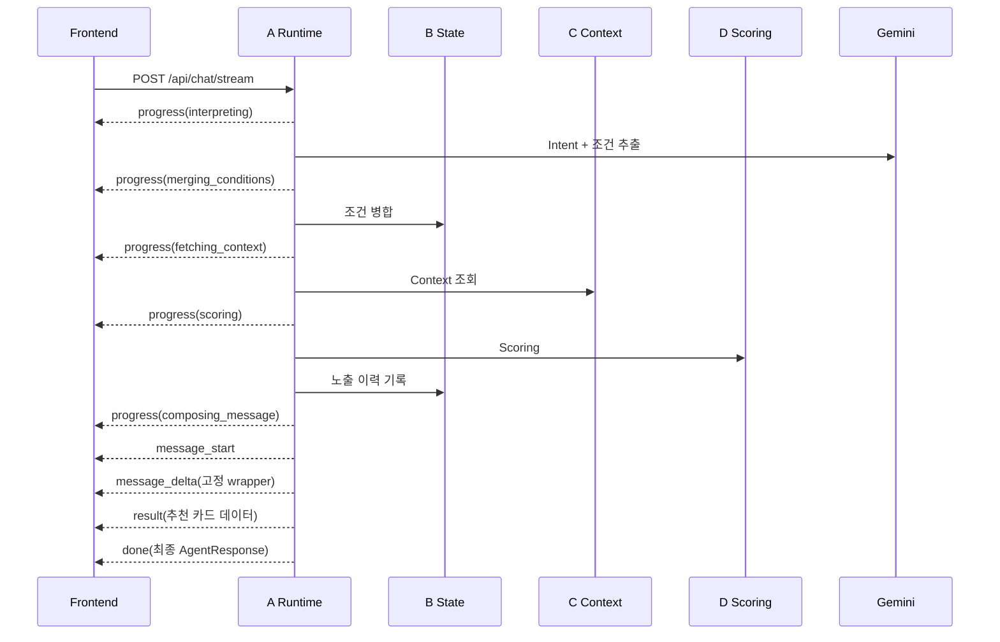

# Agent 응답 진행 상태·SSE 스트리밍 설계

## 문서 정보

| 항목 | 값 |
| --- | --- |
| 상태 | ✅ 2차 구현 완료 — 추천 카드 선표시, GENERAL·장소 INFO LLM 답변 스트리밍 |
| 작성일 | 2026-08-12 |
| 담당 | A (Agent Runtime) / Frontend |
| 관련 코드 | `backend/app/services/runtime/agent_runtime.py`, `backend/app/services/runtime/response_composer.py`, `backend/app/routes/chat.py`, `frontend/src/components/chat/AgentProgressMessage.tsx` |
| 관련 계약 | `docs/api-contracts.md`, `docs/design/agent-response-generation.md` |
| 구현일 | 2026-08-12 |

## 1. 배경과 문제

구현 전 프론트의 `AgentProgressMessage`는 실제 Agent Runtime 상태를 받지 않고, 고정된
1.8초 간격으로 아래 문구만 바꿨다.

```
요청 의도와 조건 파악 → 대화 조건 병합 → 장소 정보 조회 → 추천 순위 계산 → 답변 정리
```

따라서 약 7.2초가 지나면 백엔드가 어느 단계에 있든 항상 **"답변 정리 중"**으로
표시된다. 이 문구에 오래 머문다고 `compose_chat_message()`가 병목이라는 뜻은 아니다.

현재 `POST /api/chat`은 한 요청이 끝난 뒤에만 완전한 `AgentResponse` JSON을 한 번
반환한다. RECOMMEND/MODIFY 성공 경로의 주요 호출은 다음과 같다.

1. Gemini Intent 분류 + 조건 추출 (순차 2회)
2. A→B 조건 병합
3. A→C 장소·운영시간·날씨 등 Context 조회
4. A→D Scoring
5. 고정 추천 wrapper 전송(LLM 호출 없음)
6. 완성된 `AgentResponse` 반환

외부 호출 비중은 질문·캐시·재시도 상황에 따라 달라진다. 일반적으로 1, 3이 지연
후보이며 D의 점수 계산은 상대적으로 작다. 개발자 Audit의 `소요시간` 탭에서 단계별
duration과 답변 스트림의 TTFT를 확인할 수 있다.

## 2. 목표와 범위

### 2.1 목표

- 타이머 기반 안내를 실제 실행 단계와 실제 경과 시간 기반 안내로 교체한다.
- 추천 카드 데이터와 고정 wrapper를 준비되는 즉시 함께 표시한다.
- GENERAL·장소 INFO처럼 실제 자연어 답변이 필요한 경로만 SSE(Server-Sent Events)로
  조각 단위로 표시한다.
- 기존 `POST /api/chat` 계약과 프론트 일반 동작을 깨지 않는다.
- 개발자 Audit에는 최종 `AgentResponse`, 단계별 duration, 스트리밍 답변의 TTFT를 남긴다.

### 2.2 구현 범위

| 포함 | 제외 / 후속 |
| --- | --- |
| RECOMMEND / MODIFY 성공 응답 | concentration/event INFO의 정확성 우선 템플릿 스트리밍 |
| GENERAL 자유 답변 스트리밍 | SCHEDULE 계획 LLM의 구조화 출력 토큰 스트리밍 |
| C `PlaceInfoResult(fields)`가 있는 장소 INFO 답변 스트리밍 | COMPARE의 3~6줄 비교문 스트리밍 |
| 실제 단계 진행 이벤트 | SCHEDULE 계획 LLM의 구조화 출력 토큰 스트리밍 |
| 추천 카드·고정 wrapper 즉시 표시 | COMPARE의 3~6줄 비교문 스트리밍 |
| 취소·오류·기존 단발 응답 폴백 | 모델의 구조화 JSON(일정·조건 추출) 스트리밍 |

GENERAL은 `message_start → message_delta`로 바로 스트리밍한다. 장소 INFO는 C가 검증한
`PlaceInfoResult.fields`만 프롬프트 근거로 보내 2~4문장 안내를 생성한다. 반면 혼잡도·행사
INFO와 no-data/오류는 정확성을 위해 기존 고정 템플릿을 유지한다. SCHEDULE은
`ScheduleLLMPlan` 구조화 출력 전체가 검증된 뒤에만 안전하게 카드를 만들 수 있어 제외한다.

## 3. 핵심 결정과 구현 방식

### 3.1 실제 단계 이벤트를 먼저 보낸다

`run_agent_flow()`의 실제 호출 지점에서 아래 `progress` 이벤트를 보낸다. 라우트가
각 이벤트에 `time.monotonic()` 기반 누적 `elapsed_ms`를 붙인다. B-07 Trace의
`llm_interpret`, `tool_fetch`, `scoring` 계약은 그대로 유지한다.

| 이벤트 단계 | 이벤트 전송 위치 | 직전부터 수행된 처리 |
| --- | --- | --- |
| `interpreting` | LLM 해석 시작 직전 | 이전 단계 없음 |
| `merging_conditions` | `transform()` + `apply()` 직전 | Intent 분류 + Intent별 조건 추출 |
| `fetching_context` | `tool_provider.fetch_context()` 직전 | A→B 조건 병합·run_id 발급 |
| `scoring` | D 1차 Scoring 직전 | A→C Context/외부 Tool 호출 |
| `composing_message` | 답변 wrapper/LLM 생성 직전 | A→D와 필요한 C 혼잡도 보강 |

`llm_interpret`/`tool_fetch`/`scoring` Trace 계약은 유지한다. 이 표의 값은 호출자에게
보여 주는 실행 관측용이며, Trace의 step 이름을 바꾸는 작업이 아니다.

### 3.2 카드와 wrapper를 즉시 표시한다

RECOMMEND/MODIFY에서 추천 결과는 C/D가 끝난 뒤 이미 결정돼 있다. 카드의 상세 정보와
근거도 이미 완결됐으므로, 고정 wrapper를 즉시 보낼 수 있다.

```
C/D 완료
  → B에 실제 노출 추천 이력 저장
  → 고정 wrapper를 message_delta로 전송
  → 추천 카드 데이터 전송·렌더링
  → 최종 AgentResponse 확정
```

### 3.3 진짜 스트리밍과 글자 효과를 구분한다

- **프론트 글자 효과만 적용**: 완성된 `message`를 받은 뒤 한 글자씩 재생한다. 구현은
  간단하지만 TTFT와 네트워크 대기 시간은 줄지 않는다.
- **이 설계의 SSE 스트리밍**: Gemini가 생성한 조각을 서버가 받는 즉시 브라우저에
  전달한다. 카드 준비 후 요약 첫 조각부터 표시하므로 실제 TTFT가 줄어든다.

이 구현은 후자를 기본으로 하며, Gemini가 문장 단위처럼 큰 청크를 보내도 사용자가 생성
과정을 읽을 수 있도록 프론트가 수신 텍스트를 한글자씩 렌더링한다. 이는 완성 응답을
재생하는 가짜 스트리밍이 아니라, 이미 시작된 실제 SSE 스트림의 표시 방식이다.

## 4. API 설계

### 4.1 기존 API 유지

기존 API는 변경하지 않는다.

```http
POST /api/chat
Content-Type: application/json

AgentRequest → AgentResponse
```

기존 사용자 화면, 테스트, 외부 호출자는 계속 이 경로를 사용할 수 있다.

### 4.2 신규 스트리밍 경로 (구현 완료)

```http
POST /api/chat/stream
Content-Type: application/json
Accept: text/event-stream

AgentRequest → SSE event stream
```

`EventSource` 브라우저 API는 GET만 지원하므로, `AgentRequest` 본문과 `session_id`를
안전하게 전달해야 하는 이 경로에서는 **`fetch()` + `ReadableStream`으로 SSE를 읽는
방식**을 권장한다. 서버는 `sse-starlette.EventSourceResponse`를 사용해
`text/event-stream`을 반환한다.

### 4.3 이벤트 계약

모든 이벤트에는 라우트가 계산한 누적 `elapsed_ms`를 포함한다. `run_id`는 `result`와
`done.response`의 `state`에서 확인한다. 별도 `request_id`와 단계별 개별 duration은
1차 구현 범위에 넣지 않았다.

```text
event: progress
data: {
  "stage": "interpreting",
  "message": "요청 의도와 조건을 파악하고 있어요.",
  "elapsed_ms": 0
}

event: location_resolved
data: {
  "elapsed_ms": 900,
  "current_location": "안국역",
  "search_center": "광화문역"
}

event: result
data: {
  "state": { "session_id": "...", "run_id": "...", "...": "..." },
  "llm_output": { "...": "..." },
  "recommendations": { "...": "..." }
}

event: message_delta
data: { "elapsed_ms": 1234, "text": "현재 계신 곳에서 " }

event: message_start
data: { "elapsed_ms": 1200, "intent": "GENERAL" }

event: done
data: {
  "elapsed_ms": 3456,
  "response": { "...최종 AgentResponse...": "..." }
}

event: follow_ups
data: {
  "elapsed_ms": 4012,
  "suggestions": ["여기 주차되나요?", "이 근처 카페도 알려줘"]
}

event: error
data: {
  "elapsed_ms": 3456,
  "code": "provider_unavailable",
  "message": "Gemini 연동에 문제가 발생했습니다.",
  "retryable": true
}
```

`result`는 카드 렌더링에 필요한 확정 데이터만 먼저 담는다. `message`는 비워 두고,
`message_delta`로 누적한다. `done.response`는 저장·Audit·재현에 쓰는 완전한 최종
`AgentResponse`다.

`location_resolved`는 조건 병합(`apply()`) 직후, `fetching_context` 진행 이벤트보다
앞서 나간다. 이번 턴이 실제로 쓸 출발지·검색 기준이 그 시점에 확정되고, 화면
우상단 위치 칩이 이 값을 보여준다 — `done`까지 기다리면 도구 조회·채점·답변
스트리밍이 모두 끝난 뒤라, 발화로 위치를 바꿔도 결과가 다 나올 때까지 이전 위치가
그대로 보인다. 모든 Intent가 지나가는 공통 경로에서 보내며, 두 값은 각각 null일 수
있다(그때는 서버도 위치를 모른다는 뜻이라 화면은 지금 값을 유지한다). 영어 요청에서도
숨기지 않는다 — 장소 이름은 번역 대상이 아니고 `done.response.state`가 어차피 같은
값을 담아 온다. 단발 `POST /api/chat`에는 이 이벤트가 없다.

**`follow_ups`는 `done` 뒤에 오는 유일한 이벤트다**(D-102). 후속 질문 생성은 답변이
이미 화면에 다 뜬 뒤에 도는 LLM 호출이라, `done` 앞에 두면 그 시간만큼 턴이 안 끝나
답변과 카드 아래에 로딩 말풍선이 한 번 더 뜬 것처럼 보인다. 화면은 `done`에서 턴을
끝내 로딩을 감추고 입력창을 풀고, 버튼만 조금 늦게 붙인다. 제안할 게 없으면 서버는
이 이벤트를 보내지 않으며, `done.response.suggested_follow_ups`는 이 경로에서 항상
빈 배열이다(단발 `POST /api/chat`에서는 반대로 응답 안에 담겨 온다 — 나눠 보낼
스트림이 없다).

### 4.4 단계 전이



## 5. 백엔드 설계

### 5.1 A Runtime 이벤트 훅

`run_agent_flow()`에 선택적 `stream_event_sink`와
`stream_recommendation_summary` 인자를 추가했다. 기존 `/api/chat`은 두 인자를 넘기지
않아 완성된 `AgentResponse`를 한 번 반환하는 동작을 유지한다. `/api/chat/stream`만 같은
실행 중간에 `progress`/`result`/`message_delta`를 sink로 전달한다. 따라서 B/C/D 호출과
추천 이력 기록은 한 번만 일어나며, B/C/D 공개 계약은 바꾸지 않는다.

### 5.2 RECOMMEND/MODIFY는 LLM 요약을 호출하지 않는다

추천 카드 wrapper는 `_RECOMMEND_WRAPPER_MESSAGE`를 `message_delta` 한 번으로 전송한다.
이미 C/D가 결정한 추천 결과를 소개하기 위해 Gemini를 한 번 더 호출하지 않으므로, 카드
응답은 마지막 모델 대기 없이 완료된다. GENERAL·장소 INFO의 실제 자연어 답변은 기존의
Gemini 텍스트 스트리밍을 유지한다.

### 5.3 오류·취소

- 브라우저 연결이 끊기면 SSE route가 실행 task를 취소한다. 이미 B에 기록된 추천 이력은
  결과가 확정된 뒤 기록하므로, 카드 `result` 뒤의 실제 답변 스트림 취소가 추천 결과를 되돌리지는
  않는다. 프론트 `AbortController` 취소 UI는 후속 범위다.
- C/D 실패처럼 카드 생성 전의 `AppError`는 `error` 이벤트로 현재 HTTP 오류 형식의
  `code/message/retryable`을 그대로 전달한다.
- SSE endpoint에 연결되기 전 실패(구버전 배포/프록시 미지원)하면 프론트는 기존
  `POST /api/chat` 단발 요청으로 한 번 폴백한다. 이벤트를 하나라도 받은 뒤에는 중복
  실행을 막기 위해 오류를 그대로 사용자에게 보여 준다.

## 6. 프론트 설계

### 6.1 실제 진행 상태 표시

`AgentProgressMessage`의 고정 `setInterval()`을 제거한다. 마지막으로 받은
`progress.stage`만 활성 상태로 표시하고, `elapsed_ms`를 함께 보여 준다.

| 서버 stage | 사용자 문구 |
| --- | --- |
| `interpreting` | 요청 의도와 조건을 파악하고 있어요. |
| `merging_conditions` | 이전 대화 조건을 반영하고 있어요. |
| `fetching_context` | 장소·운영시간·날씨 정보를 찾고 있어요. |
| `scoring` | 조건에 맞게 장소 순위를 계산하고 있어요. |
| `composing_message` | 추천 결과를 안내하고 있어요. |

### 6.2 카드 선표시와 문장 누적

`result` 이벤트를 받으면 답변 위치를 고정할 수 있도록 `…`가 들어간 assistant 말풍선을
먼저 만들고, 그 **아래**에 추천 카드를 추가한다. 이후 `message_delta.text`는 카드 뒤에
새 말풍선을 만들지 않고 위쪽의 같은 말풍선에 누적한다. `composing_message` 구간에는
진행 단계 박스를 숨겨, 카드와 별도로 "답변 정리 중"이 남지 않게 한다. `done`의 최종
`AgentResponse`는 메시지·카드 중복 렌더링이 아니라 Audit 상태와 세션 식별자 확정에
사용한다.

개발자 화면은 최종 `AgentResponse`와 기존 Audit을 유지한다. 이벤트별 이력·TTFT·단계별
duration을 Audit에 영구 표시하는 기능은 후속 범위다.

## 7. 구현 결과와 후속 순서

### 완료 — RECOMMEND/MODIFY 스트리밍

1. `POST /api/chat/stream`과 `progress`/`result`/`message_delta`/`done`/`error` 이벤트를
   구현했다.
2. 고정 `setInterval()` UI를 실제 `progress.stage`와 누적 시간 표시로 교체했다.
3. RECOMMEND/MODIFY에서 C/D 완료 직후 고정 wrapper를 `message_delta`로, 추천 카드를
   `result`로 전송한다. 두 이벤트는 같은 시점에 렌더링된다.
4. GENERAL·장소 INFO의 Gemini 텍스트 스트리밍을 유지한다.
5. 사용자 채팅, 개발자 채팅, 첫 추천 시작 화면 모두 스트리밍 경로를 사용한다.
6. SSE endpoint가 시작 전에 실패하면 기존 `POST /api/chat`으로 한 번 폴백한다.

### 후속

1. 프론트 취소 버튼과 `AbortController`를 추가한다.
3. INFO/SCHEDULE/COMPARE/GENERAL의 각 응답 성격에 맞는 스트리밍 범위를 결정한다.
4. 스트림 도중 요약 LLM이 실패한 경우의 부분 문장 표기 정책을 확정한다.

## 8. 변경 대상과 소유

| 영역 | 예상 변경 파일 | 소유 |
| --- | --- | --- |
| Agent 실행 분리·이벤트 | `backend/app/services/runtime/agent_runtime.py` | A |
| 추천 wrapper 즉시 전송 | `backend/app/services/runtime/response_composer.py` | A |
| SSE 라우트·의존성 | `backend/app/routes/chat.py`, `backend/pyproject.toml` | A |
| API 계약 | `docs/api-contracts.md` | A 제안 후 갱신 |
| 일반/개발자 채팅 상태 | `frontend/src/api/trip.ts`, `frontend/src/state/TripContext.tsx`, `frontend/src/components/chat/AgentProgressMessage.tsx`, `frontend/src/pages/ChatPage.tsx`, `frontend/src/pages/DeveloperChatPage.tsx` | A/Frontend |
| C Tool·D Scoring 내부 | 변경 없음 | C/D |
| B State 계약 | 기존 `apply`·이력 기록 재사용, 변경 없음 | B |

## 9. 테스트와 완료 기준

### 완료한 테스트

- Backend: Fake LLM으로 `progress → message_start → message_delta → result` 순서와
  고정 wrapper의 즉시 전송을 고정했다 (`tests/test_agent_runtime.py`).
- Backend: RECOMMEND/MODIFY가 추천 요약 LLM을 호출하지 않는지 검증했다
  (`tests/test_response_composer.py`).
- Frontend: SSE 프레임 파싱, 카드·메시지 중복 방지, SSE route 미존재 시 단발 `/chat`
  폴백을 앱 통합 테스트로 검증했다 (`src/App.test.tsx`).
- 회귀: Backend 관련 138개 테스트, Frontend 35개 테스트, lint/build를 통과했다.
- 브라우저: 개발자 채팅에서 실제 Gemini 요청으로 진행 단계 → 고정 wrapper → 카드
  표시 순서를 확인했다.

### 완료 기준

- 진행 UI가 고정 타이머가 아닌 실제 `progress` 이벤트를 표시한다.
- RECOMMEND/MODIFY에서 Gemini 요약 호출 없이 wrapper와 추천 카드가 즉시 표시된다.
- GENERAL·장소 INFO는 실제 Gemini 조각 수신에 따라 답변을 누적한다(프론트 재생 효과만으로
  대체하지 않는다).
- SSE endpoint 연결 실패 시에도 기존 `/api/chat` 경로로 추천 결과를 받을 수 있다.
- 개발자 Audit이 단계별 duration과 스트리밍 답변의 TTFT를 표시한다.

## 10. 후속 확인 사항

- `sse-starlette.EventSourceResponse`를 런타임 의존성으로 채택했다.
- 스트림 중 Gemini가 실패했을 때, 이미 표시한 GENERAL·INFO 문장을 그대로 두고 `done`으로
  정상 종료할지, 별도 `message_incomplete`를 사용자/개발자 화면에 표시할지 결정이
  필요하다.
- 단계별 duration·TTFT를 일반 `AgentResponse`에 넣을지, 개발자 전용 메타데이터에만
  둘지 API 계약 확인이 필요하다. 현재는 개발자용 프론트 Audit에만 보관한다.
- COMPARE/SCHEDULE 스트리밍 확장 순서는 GENERAL·INFO 실측 결과 후 결정한다.
