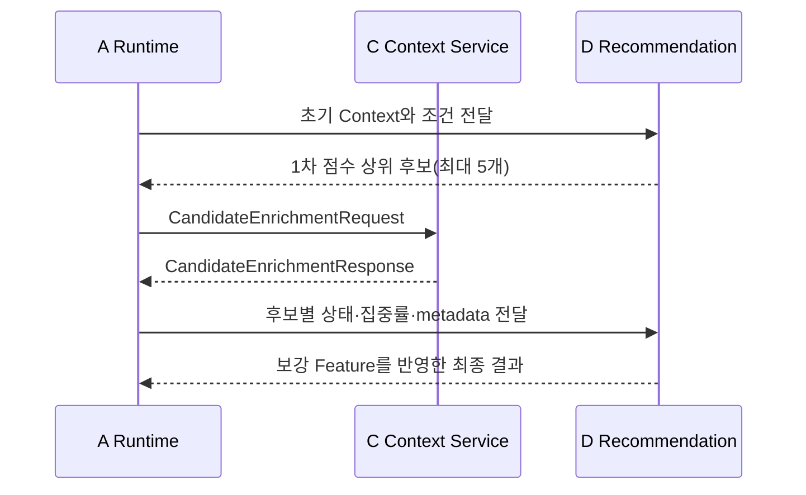
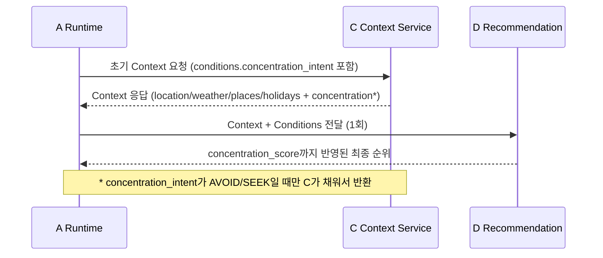
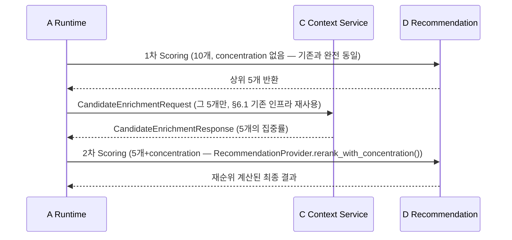

# Agent Runtime (A) — B/C/D 연결 계약 및 구현 현황

## 문서 정보

| 항목 | 값 |
|------|-----|
| 버전 | v1 |
| 상태 | Draft (§6 혼잡률 보강은 D-040로 안 B 채택·구현 완료, B의 `concentration_intent` 필드 연결도 B-06으로 완료) |
| 최종 수정 | 2026-08-05 |
| 관련 코드 | `backend/app/services/runtime/`, `backend/app/services/interpret/state_transform.py`, `backend/app/state/service.py`, `backend/app/services/recommendation_pipeline.py` |

이 문서는 Agent Runtime(A)이 B(Agent State)/C(Tool Intelligence)/D(Recommendation)와
주고받는 변환 함수와 호출 순서를, 채팅으로 확정한 협의 내용과 실제 구현 상태를 기준으로
정리한다. 각 절은 "완료"와 "TODO"를 명확히 구분한다. 모든 함수 시그니처는 이 문서
작성 시점에 실제 코드를 다시 읽어 옮긴 것이다.

---

## 1. 개요

A는 사용자 발화 하나를 받아 B/C/D 호출 순서를 조정하는 상위 오케스트레이션 계층이다.
B/C/D는 서로 직접 부르지 않고 항상 A를 거쳐서만 결과를 주고받는다 — B/C/D는 각자
내부 판단(Tool 선택, Scoring, State 저장 규칙 등)만 책임지고, "언제 누구를 부를지"는
전부 A(`app/services/runtime/agent_runtime.py::run_agent_flow()`)가 정한다.

### 1.1 전체 호출 순서

```
사용자 발화
  → A→B: 세션 컨텍스트 조회 + GPS·날씨 최신화 (ensure_current_context)
  → A: Intent 분류 + 조건 추출 (LLM)
  → A→B: 조건 병합 (transform → apply)
  → [RECOMMEND/MODIFY이고 status=complete일 때만]
      → A→C: Context 조회 (to_agent_context_request → fetch_context)
      → [C 응답 status가 success/partial/no_data일 때만]
          → A→D: 추천 실행 (RealRecommendationProvider.recommend)
          → A→B: 노출 결과 기록 (record_recommendation)
  → A: 최종 응답 조립 (AgentResponse)
```

> **✅ 2026-08-02 D 확인 완료(D-040) — `concentration_intent`가
> `AVOID`/`SEEK`일 때의 확장 흐름.** 위 다이어그램은 그대로 두고,
> `concentration_intent`가 있을 때만 "A→D: 추천 실행" 한 줄이 아래처럼
> 늘어난다(구현 완료, 상세는 §6.5.2).
>
> ```
>       → [concentration_intent가 AVOID/SEEK일 때]
>           → A→D: 1차 Scoring (10개, concentration 없음 — 기존과 동일)
>           → A→C: 그 상위 5개만 혼잡도 조회 (CandidateEnrichmentRequest 재사용)
>           → A→D: 2차 Scoring (5개+concentration — RealRecommendationProvider.
>               rerank_with_concentration() 구현 완료)
>       → A→B: 노출 결과 기록 (record_recommendation) — 위치는 그대로, 다만
>               기록 대상이 "1차 직후"가 아니라 "2차 재순위 이후, 최종 5개"로 바뀜
> ```
>
> `concentration_intent`가 `null`/`IGNORE`이면 이 확장은 타지 않고 기존
> 다이어그램 그대로 D 1회 호출로 끝난다.
>
> **✅ 2026-08-05 B 확인 완료(B-06, [PR #78](https://github.com/genai-TeamROOT/tripbranch/pull/78))
> — B(State)의 `StateUserConditions`에 `concentration_intent` 필드가 등록됐다.**
> 이제 `run_agent_flow()` 전체 통합 테스트로도 이 분기가 실제 트리거된다
> (`test_concentration_intent_persisted_by_b_triggers_rerank` 참고,
> `enrichment_provider.call_count == 1`로 검증).

### 1.2 변환 함수 공통 원칙

경계마다 변환을 전담하는 지점을 정확히 하나만 둔다 — 서로 다른 경계의 변환을 섞지
않는다.

| 경계 | 전담 함수 | 위치 |
| --- | --- | --- |
| B→A | `to_user_conditions()` | `app/services/interpret/state_transform.py` |
| A→B | `transform()` | `app/services/interpret/state_transform.py` |
| A→C | `to_agent_context_request()` | `app/services/runtime/context_transform.py` |
| A→D | `to_search_radius_km()` | `app/services/runtime/recommendation_transform.py` |
| D→B | `to_record_recommendation_request()`(*) | `app/services/runtime/recommendation_transform.py` |
| D→사용자 | `compose_recommendation_message()` | `app/services/runtime/response_composer.py` |

(*) `to_record_recommendation_request()`는 작성되어 있으나, 지금 `agent_runtime.py`의
7단계는 이 함수를 쓰지 않고 같은 로직을 인라인으로 직접 수행한다(§4.4, §8 참고).

---

## 2. A↔B 변환 (완료)

### 2.1 `to_user_conditions()`

```python
def to_user_conditions(state_conditions: StateUserConditions) -> UserConditions
```

B의 `app.state.schema.UserConditions`(순수 문자열)를 A의 `app.schemas.UserConditions`
(enum 타입)로 변환한다. 필드 14개가 이름·개수 동일해서 `model_dump()` → `model_validate()`
왕복으로 충분하다(StrEnum이 문자열 값을 그대로 받아들임). MODIFY 조건 추출 시 현재
조건을 다시 LLM에 넘기기 위해 필요하다.

### 2.2 `transform()`

```python
def transform(
    llm_output: LLMOutput,
    session_context: SessionContextResponse,
    user_input: str,
) -> StateApplyRequest
```

`LLMOutput`을 B가 받는 `StateApplyRequest`로 변환한다. Intent/ModifyType별 규칙:

| Intent / ModifyType | `operations` | `rejected_places` | `reset_scope` |
| --- | --- | --- | --- |
| RECOMMEND | 조건 전체 재생성(`_full_replace_operations`) | 없음 | **항상 `"soft"`** |
| MODIFY / REJECT_ALL | 없음 | 직전 노출 전체(`reason_code="not_interested"`) | phrase 매칭 시 그 값, 아니면 `None` |
| MODIFY / CHANGE_CONDITION | `changed_fields`만 반영(`_changed_field_operations` + `_place_tag_cleanup_operations`) | **없음**(2026-07-27 수정 — 아래 §2.3 참고) | phrase 매칭 시 그 값, 아니면 **항상 `"history"`** |
| INFO / COMPARE / GENERAL / OUT_OF_SCOPE | 없음 | 없음 | `None` |

`reset_scope` phrase 판정(`_RESET_SCOPE_PHRASES`, 우선순위 순):
`"처음부터 다시"` → `history`, `"조건 다시 정할게"`/`"조건 다시 정하고 싶어"` → `soft`,
`"새로 시작"` → `full`.

### 2.3 알려진 이슈 — 해결 완료: B의 영구 제외 문제

B의 `get_exclusion_place_ids()`(`app/state/history.py`)는 `recommended ∪ rejected`로
제외 대상을 계산하며, 한 번 이 집합에 들어간 place_id는 세션 내내 빠지지 않는다.

**증상(수정 전)**: CHANGE_CONDITION이 직전 노출 전체를 `rejected(reason="other")`로
무조건 기록했다. "카페 말고 맛집으로" → "아 다시 카페로"처럼 조건이 되돌아와도, 카페들이
`rejected`에 영구히 남아 다시 노출되지 않았다.

**수정 내용(A 쪽 조정만으로 해결, B의 exclusion 계산은 변경하지 않음)**:
1. CHANGE_CONDITION이 직전 노출을 `rejected`로 기록하던 로직 제거.
2. `_detect_reset_scope()`가 CHANGE_CONDITION이면 phrase가 없어도 기본값으로 `"history"`를
   반환하도록 확대 — B의 `reset_scope="history"`는 `recommended`만 비우고 `rejected`는
   유지하는 기존 메커니즘(`app/state/session.py::apply_reset()`)을 그대로 활용한다.

결과: REJECT_ALL로 명시 거절한 장소는 여전히 영구 제외되고(`rejected`에 남음),
CHANGE_CONDITION으로 밀려난 장소는 조건이 되돌아오면 다시 노출 후보가 된다.

### 2.4 B 서비스 함수 시그니처

```python
def get_session_context(session_id: str | None, store: StateStore | None = None) -> SessionContextResponse
def apply(request: StateApplyRequest, store: StateStore | None = None) -> StateApplyResponse
def update_api_context(request: UpdateApiContextRequest, store: StateStore | None = None) -> UpdateApiContextResponse | None
def record_recommendation(request: RecordRecommendationRequest, store: StateStore | None = None) -> RecordRecommendationResponse
```

전부 `app/state/service.py`. **동기 함수다** — `await`를 붙이지 않는다(`apply()`,
`update_api_context()` 모두 `async def`가 아님).

`apply()`는 `confirmed=False`(status가 `complete`가 아님)면 State를 바꾸지 않고 현재
상태만 반환하도록 이미 구현돼 있다 — A는 needs_clarification을 따로 걸러서 `apply()`를
건너뛸 필요가 없다.

`update_api_context()`는 세션이 없으면 세션을 만들지 않고 `None`을 반환한다(B 계약상
read-only). 세션은 오직 `apply()`만 생성한다 — 그래서 최초 턴에는 `ensure_current_context()`
가 GPS를 심을 세션이 없다(§2.5).

### 2.5 GPS 최초 턴 심기 (구현 완료, 중복 정리는 TODO)

`app/services/interpret/session_orchestrator.py::ensure_current_context()`는 세션이
이미 있을 때만 GPS를 갱신한다. 그래서 `agent_runtime.py::run_agent_flow()`는 3번(조건
병합) 직후 3-1단계를 따로 둔다:

```python
if state_response.session_created and valid_gps:
    update_api_context(
        UpdateApiContextRequest(
            session_id=state_response.session_id,
            gps_location=valid_gps,
            gps_location_updated_at=now_kst(),
        ),
        store=store,
    )
```

GPS 형식 검증(`_valid_location()`)도 `run_agent_flow()`에 구현돼 있다 — `"위도,경도"`
형식이 아니면 `None`으로 낮춰서 이번 턴만 건너뛴다. **다만 `app/routes/interpret.py`
라우터에도 동일한 `_valid_location()`이 독립적으로 존재한다**(코드 주석에 "interpret.py의
동일 함수와 중복 — interpret.py가 run_agent()로 교체되면 정리한다"고 명시돼 있음) —
§8 참고.

---

## 3. A↔C 변환 (완료)

### 3.1 `to_agent_context_request()`

```python
def to_agent_context_request(
    request_id: str,
    conditions: UserConditions,
    gps_location: str | None = None,
    excluded_place_ids: list[str] | None = None,
    resolved_search_center: Coordinates | None = None,
) -> AgentContextRequest
```

`app/services/runtime/context_transform.py`. A의 `app.schemas.UserConditions`(enum
타입)를 C의 `AgentContextRequest`(`app.agent_context.schemas`, Literal 타입)로 변환한다.
필드 14개가 이름·값 동일해서 `model_dump()` → `model_validate()` 왕복으로 충분하다.
`request_id`는 `app.state.session.new_trace_id()`로 호출마다 새로 생성한다.
`resolved_search_center`는 **보충 조회에서만** 채운다. 첫 조회가 확정한 기준점 좌표를
넘기면 C가 위치 해석·날씨·공휴일을 건너뛰고 장소만 다시 준다. 그 셋은 보충 배치에서
`_merge_recommendation_context_places()`가 버리는 값이라, 계산하지 않는 것뿐이고 동작은
달라지지 않는다(보충 1회 외부 호출 7건 → 2건).

`gps_location`은 이번 요청의 유효한 `device_location`을 우선하고, 없으면 B에 저장된
만료되지 않은 GPS를 사용한다. 변환 경계에서 `"위도,경도"` 문자열을 C 계약의
`Coordinates` 객체로 바꾸며, 형식 또는 범위를 벗어난 값은 `None`으로 낮춘다.

**`search_radius_km` 파라미터가 없다** — C는 이 값을 A에게 받지 않고
`conditions.max_travel_time`으로부터 자체 계산한다(§4.1 참고).

### 3.2 발화 5단계 vs C의 날씨 사실

`conditions.weather`(A→C 요청)는 사용자가 말한 5단계(`rain`/`snow`/`hot`/`cold`/`good`)이고,
`RecommendationContext.weather.data`(C→A 응답)는 C가 Provider 결과를 정규화한
**사실**(`precipitation`/`sky`/`temperature_celsius`)이다. A는 `conditions`를 C에
전달하고, C가 자신의 규칙에 따라 D에서 쓸 날씨 정보를 `context.weather`에 담아
반환한다. A는 이 값을 **판정하지 않고 그대로** D에 전달한다.

3단계(`good`/`neutral`/`bad`) 판정은 D-051로 D에 이관됐다 — 판정에는 사용자 의도
(`weather_intent`의 `AVOID`/`ENJOY`)가 필요하고 그 값을 가진 쪽이 D다. A와 C 어느
쪽도 판정값을 만들거나 중계하지 않는다.

### 3.3 C 응답(`AgentContextResponse`) status별 처리

| status | `context` | A/D 후속 처리 |
| --- | --- | --- |
| `success` | 있음 | Recommendation 단계로 진행 |
| `partial` | 있음(일부 결측) | 경고 있는 채로 진행 |
| `no_data` | 있음(빈 목록/null) | 진행(D가 "후보 없음" 처리) |
| `needs_clarification` | `null` | **여기서 끝** — LLM 단계 needs_clarification과 별개 레이어 |
| `unsupported` | `null` | **여기서 끝** |
| `unavailable` | `null` 또는 실패 Context만 | **여기서 끝** |

`_TOOL_TERMINAL_STATUSES = {"needs_clarification", "unsupported", "unavailable"}`
(`agent_runtime.py`)에 해당하면 D 호출 없이 `AgentResponse(recommendations=None)`을
바로 반환한다. `needs_clarification`인데 `error`도 채워진 경우(계약 §5.5 위반 의심)는
로그만 남기고 흐름은 막지 않는다.

`context`가 있어도 `None`이면(스키마상 `no_data`에서 허용) 마찬가지로 D를 호출하지
않고 종료한다.

---

## 4. A↔D 변환 (완료)

### 4.1 `to_search_radius_km()`

```python
def to_search_radius_km(conditions: UserConditions) -> float
```

`app/services/runtime/recommendation_transform.py`. C(`app.agent_context.service.
_resolve_search_radius_km()`)와 **정확히 동일한 공식**이다:

- `max_travel_time`이 `None`이면 기본값 `2.0km`.
- 있으면 `max_travel_time * 0.07`(70m/min, 도보 속도 고정 — `transport` 값은 쓰지
  않는다. C도 안 쓴다, MVP는 도보 속도만 가정).
- 결과를 `[0.3, 20.0]` 구간으로 clamp.

C가 `context.places`를 조회할 때 이 공식으로 반경을 이미 정했으므로, A가 D에 넘기는
값도 같아야 거리 점수 정규화(`max_distance_km`)가 어긋나지 않는다
(`run_recommendation_pipeline_from_context()` docstring 명시).

**해결 완료(2026-07-28)**: 기본값·속도·clamp 범위 전부 `app/place_search_policy.py`
(공유 상수 모듈: `DEFAULT_PLACE_SEARCH_RADIUS_KM`, `WALKING_SPEED_KM_PER_MINUTE`,
`MIN_PLACE_SEARCH_RADIUS_KM`, `MAX_PLACE_SEARCH_RADIUS_KM`)로 옮겨져 A(`recommendation_
transform.py`)와 C(`agent_context/service.py`)가 **같은 상수를 import**해서 쓴다 —
각자 하드코딩해서 우연히 값이 같던 이전 상태(§8에 있던 이슈)가 구조적으로 해소됐다.
`tests/test_recommendation_transform.py::test_matches_c_formula`가 C의
`_resolve_search_radius_km()`와의 일치를 계속 자동 검증한다.

### 4.2 `to_weather_condition()` — 제거됨 (D-051)

A가 C 응답을 `WeatherCondition`으로 변환하던 함수로, **더 이상 존재하지 않는다.**
판정에 사용자 의도가 필요하다는 이유로 D에 이관됐고, 지금은 D의
`resolve_weather_condition()`이 `recommendation_pipeline.py`에서 사실과
`weather_intent`를 함께 보고 판정한다.

A는 `context.weather`를 그대로 D에 넘기기만 한다. 결측 처리도 그대로여서, D의
`explanation.py`가 날씨 결측을 warnings로 반영하므로 A는 결측 여부를 따로
판단하지 않는다.

### 4.3 `RealRecommendationProvider`

```python
class RealRecommendationProvider:
    async def recommend(
        self,
        conditions: UserConditions,
        context: RecommendationContext,
        excluded_place_ids: list[str],
    ) -> RecommendationResponse
```

`app/services/runtime/real_recommendation_provider.py`. `RecommendationProvider`
Protocol(`protocols.py`)을 만족하는 실제 구현체.

```python
search_radius_km = to_search_radius_km(conditions)
return await run_recommendation_pipeline_from_context(
    context,
    visit_at=datetime.now(ZoneInfo("Asia/Seoul")),
    search_radius_km=search_radius_km,
    shown_place_ids=frozenset(excluded_place_ids),
    recommendation_limit=5,
)
```

D 내부(`candidate_mapper`/`scoring`/`evidence`/`explanation`)는 직접 import하지 않고
`run_recommendation_pipeline_from_context()` 공개 진입점 하나만 거친다.

**D가 확정해준 사용 가이드**:

- `context`가 `None`이어도(예: 호출자 오류) 그대로 넘겨도 안전하다 — D가 `AppError`로
  처리한다(`context is None` → `AppError(code="context_unavailable", ...)`).
- `visit_at`은 반드시 KST(timezone-aware)여야 한다.
- `search_radius_km`은 C 요청 계산과 D 호출에 같은 값이어야 한다 — 실제로는
  `agent_runtime.py`에서 `agent_conditions`를 **한 번만 계산**해서 `to_agent_context_
  request()`(C 요청 조립)와 `recommendation_provider.recommend(agent_conditions, ...)`
  (D 호출) 양쪽에 같은 객체로 넘기므로, `max_travel_time` 입력값 자체가 이미 동일하게
  보장된다. 다만 C 요청 쪽은 `search_radius_km`을 값으로 받지 않고 자체 계산하므로
  ("동일한 값을 두 곳에 전달"이 아니라) A와 C가 **같은 공식으로 각자 계산**해서 결과가
  일치하는 구조다(§4.1의 주의 참고).
- `candidate_limit` 파라미터는 없다(D 내부 기본값만 있음). `concentration`은 이 진입점
  범위 밖이다(§6).
- `AppError` 발생 시 A는 잡지 않고 그대로 전파한다 — `app/main.py`에 이미
  `@app.exception_handler(AppError)`가 전역 등록돼 있어 FastAPI가 처리한다. 이는
  기존 `run_recommendation_pipeline()`(Tool 직접 호출 버전)의 관례와도 일치한다.

**✅ 2026-08-02 D 확인 완료·구현 완료(D-040)**: `concentration_intent`가
`AVOID`/`SEEK`이면 `recommend()` 시그니처는 그대로 두고, 별도 신규 메서드
`RecommendationProvider.rerank_with_concentration(conditions, context, first_pass,
concentration)`를 추가로 호출하는 구조로 확정됐다(§6.5.2) — 1차는 이 `recommend()`
그대로(10개, `recommendation_limit=5`), 2차는 `rerank_with_concentration()`이
1차 상위 5개 + concentration을 받아 재순위를 계산한다(`real_recommendation_provider.py`
구현 완료). `null`/`IGNORE`는 여전히 `recommend()` 1회만 호출된다.

2번째 파라미터는 한때 `weather_condition: WeatherCondition | None`으로 좁혔다가
`context: RecommendationContext`로 되돌렸다(D-051 2차 Scoring 배선 통일). 판정이
D로 이관되면서 A가 넘길 판정값 자체가 없어졌고, D가 1차와 동일하게
`resolve_weather_condition()`으로 직접 판정해야 두 차수의 근거 문장이 갈리지 않는다.

### 4.4 D→B: 노출 결과 기록

`to_record_recommendation_request()`가 작성돼 있지만(§1.2), 실제 `run_agent_flow()`
7단계는 이 함수를 쓰지 않고 같은 로직(recommendations + unverified_recommendations를
순서대로 이어붙여 1부터 rank 부여)을 인라인으로 수행한다. 기능은 동일하다 — §8에
정리 필요 항목으로 남겨둔다.

### 4.5 알려진 이슈 — 해결 완료: `run_agent()` → `RealRecommendationProvider` 연결

**해결일**: 2026-07-28.

`run_agent()`는 `recommendation_provider`를 `FakeRecommendationProvider()`로 하드코딩하고
있었다. 확인 결과 이 자리(ToolProvider/RecommendationProvider Protocol 구현체 선택)엔
애초에 설정 기반 fake/real 분기가 없다 — C의 `get_context_provider()`
(`app/agent_context/factory.py`)도 항상 real `ContextService`를 반환하는 하드코딩
구조이고, fake/real 분기는 그 한 단계 아래(`app.providers.factory.get_llm_provider()`
등 개별 외부 API Provider)에만 있다. 그래서 D도 같은 패턴으로 `RealRecommendationProvider()`를
직접 하드코딩했다(`FakeRecommendationProvider`는 `stubs.py`에 테스트용으로 남겨둠).

```python
recommendation_provider=RealRecommendationProvider(),  # 기존 FakeRecommendationProvider() 대체
```

**실제 E2E 검증**: `backend/scripts/try_agent_runtime.py`(신규, 수동 실행 스크립트,
`python -m scripts.try_agent_runtime`)로 같은 세션에서 RECOMMEND → MODIFY(REJECT_ALL) →
MODIFY(CHANGE_CONDITION) → INFO 4개 시나리오를 실제 Gemini + 실제 C + 실제 D로 순서대로
실행해 확인했다. 결과는
`backend/test_results/agent_runtime_e2e_timing_2026-07-28.csv` 참고.

| 시나리오 | intent | 걸린 시간 | 확인된 것 |
| --- | --- | --- | --- |
| "경복궁 근처 카페 추천해줘" | RECOMMEND | 14.89s | 실제 추천 5건, 점수·근거(거리/운영시간) 정상 |
| "다른 곳 보여줘" | MODIFY(REJECT_ALL) | 19.22s | 직전 노출 5곳 전부 제외됨 확인 |
| "무료인 곳으로" | MODIFY(CHANGE_CONDITION) | 21.81s | `search_center` 유지, `budget=free`만 반영 확인 |
| "경복궁 오늘 열어?" | INFO | 4.63s | Tool/Recommendation 스킵 확인(`recommendations=None`) |

부수 확인: 당시 시나리오는 전부 날씨 미언급 케이스였고, 현재 계약 기준에선
`weather_intent=NO_MENTION`으로 분류되어 C가 날씨 Tool을 호출한다. `IGNORE`는
"날씨 상관없어"를 명시한 경우로만 사용하며 이때만 Weather 호출을 생략한다
(관련 결정: `docs/decision-log.md` D-049).

---

## 5. D → A → 사용자 (응답 조립, 완료)

### 5.1 `compose_recommendation_message()`

```python
def compose_recommendation_message(item: RecommendationItem) -> str
```

`app/services/runtime/response_composer.py`. D가 만든 `explanations`(근거)를 먼저,
`warnings`(경고)는 `"다만, ~"` 형태로 마지막에 이어붙인다. 문장 내용 자체는 재작문하지
않고 D가 만든 그대로 쓴다.

### 5.2 D와 확정한 4가지 협의 사항

1. `explanations`는 `recommendation_reason`과 별도 필드로 존재하며 그대로 노출한다
   (재작문하지 않음, 포맷팅만 A 재량).
2. 최종 문장 조립에 필요한 필드: `name`, `place_id`, `category`, `explanations`,
   `warnings`.
3. `rank`는 응답 필드가 아니라 배열 순서다 — B에 기록할 때 A가 배열 인덱스를 rank로
   변환해서 넘긴다.
4. `explanations`(근거)와 `warnings`(경고)는 분리 유지, 조립 순서는 "근거 먼저, 경고는
   '다만~'으로 마지막".

### 5.3 D-06 상세화 반영 — `explanations`가 고정 문장에서 실측값 기반 문장으로 교체됨

`app/domain/explanation.py`가 애초 고정 문장(예: "지금 날씨 조건에 잘 맞는 장소예요.")
방식에서, `RecommendationEvidence`의 원본 계산값을 실제로 채운 문장으로 교체됐다:

- **거리**: 1km 미만은 m 단위(10m 반올림), 이상은 km 단위(소수 첫째자리) — 예:
  `"현재 위치에서 직선거리 약 350m예요."`. "직선거리"를 명시해 실제 이동거리로
  오해하지 않게 한다.
- **남은 운영시간**: 시/분 조합 — 예: `"마감까지 약 1시간 20분 남았어요."`.
- **날씨×환경 조합**: 날씨 라벨(맑은 날씨/무난한 날씨/비 예보) + 실내·야외 라벨 —
  예: `"맑은 날씨에 적합한 야외 장소예요."`.

문장은 **사실만 전달**하고 "여유롭다"/"방문하기 좋다" 같은 평가·어투는 붙이지 않는다 —
그 역할은 A(LLM Response Generator)가 이 문장들을 자연어로 이어붙일 때의 몫으로
명확히 분리돼 있다(`app/domain/explanation.py` 주석 명시). `compose_recommendation_
message()`는 이 문장들의 **내용에 관여하지 않고** 순서·구분자만 담당하므로, D가 문장
내용을 계속 다듬어도 A쪽 코드 변경이 필요 없다.

### 5.4 알려진 이슈 — 해결 완료: 챗봇 말풍선 텍스트(`AgentResponse.message`)

**해결일**: 2026-07-28. 자세한 설계·Intent별 처리·잠정 결정 근거는
[`agent-response-generation.md`](./agent-response-generation.md) 참고 — 여기서는
요약만 남긴다.

`compose_recommendation_message()`는 카드 1건의 문장만 만들고, 카드들을 감싸는
챗봇 말풍선 텍스트(`message: string`, 목표 계약 `docs/api-contracts.md` §3의
`ChatResponse.message`에 대응)는 이번에 새로 구현했다 — `compose_chat_message()`
(`response_composer.py`)가 `run_agent_flow()`의 4개 반환 지점 전부에서 호출되어
`AgentResponse.message`를 채운다. 6개 Intent 중 **GENERAL만 실제 LLM을 새로
호출**하고(`LLMProvider.generate_general_answer()`, `RealGeminiProvider`에 구현),
나머지는 전부 규칙 기반 고정 템플릿이다. INFO/COMPARE는 답변할 데이터 자체가
아직 없어 임시 안내 문구만 반환한다(별도 트랙).

---

## 6. 혼잡률(concentration) 보강

> **2026-07-29 갱신 — 방향 전환.** `concentration_intent`(RECOMMEND의 신규 조건,
> [concentration-conditions.md §2](./concentration-conditions.md#2-recommend-확장--concentration_intent))가
> D의 Scoring 가중치에 반영되어 **추천 순위 자체를 바꾸는** 것으로 결정되면서,
> 아래 §6.2~§6.4가 설계했던 "D 1차 점수 계산 → 상위 후보만 C에 재조회 → D
> 재호출" 흐름은 **채택하지 않는다.** 그 흐름은 D가 순위를 이미 확정한 뒤에
> concentration 데이터가 도착하는 구조라, 애초에 "표시용 정보만 덧붙이고 순위는
> 바꾸지 않는다"는 전제(§6.1, `a-c-context-contract-draft.md` §5.2.3의 기존 원칙)
> 에서만 성립했다. 순위에 반영해야 하는 이번 요구에는 구조적으로 맞지 않아 폐기한다.
> §6.2~§6.4는 "왜 이 방향으로 가지 않았는지" 기록으로 남기고, 실제 채택한 설계는
> §6.5에 새로 적는다.
>
> **✅ 2026-08-02 D 확인 완료·구현 완료(D-040).** 실측 성능 테스트
> 결과(§6.5 갱신분) §6.5가 "채택"이라고 적었던 초기 Context 확장 안이 이득이
> 없다고 판단해, **§6.2~§6.4가 설계했던 "D 2회 호출" 구조가 안 B로 다시
> 채택됐다** — 다만 이번엔 D의 1차 호출은 기존과 완전히 동일(10개,
> concentration 없음)하고 2차 호출만 5개+concentration으로 신규라는 점이
> §6.2 당시 설계와 다르다. §6.2~§6.4는 여전히 "채택하지 않음"(그 시점의 정확한
> 모양은 폐기)으로 남긴다. D의 2차 Scoring 신규 인터페이스(`rerank_with_
> concentration()`)는 D가 확인·구현까지 완료했다 — 상세는 §6.5.2.

### 6.1 C가 이미 구현해둔 것

- `CandidateEnrichmentRequest` / `CandidateEnrichmentTarget` / `CandidateEnrichmentResult` /
  `CandidateEnrichmentResponse` — `app/agent_context/enrichment_schemas.py`
- `CandidateEnrichmentService.enrich()` — `app/agent_context/enrichment_service.py`
- `get_candidate_enrichment_service(client)` — `app/agent_context/factory.py`

C 쪽은 스키마·서비스·Tool·Provider·Factory까지 전부 준비돼 있다. **A 쪽 연동 코드는
아직 없다.** 이 인프라 자체는 폐기하지 않는다 — "순위에는 반영하지 않고 설명에만
쓰는" post-ranking 보강이 필요해지면 그대로 쓸 수 있는 경로다.

**✅ 2026-08-02 D 확인 완료**: `concentration_intent`가 이 경로를 쓰지 않는다는
위 문장은 §6.5가 "초기 Context 확장"이던 시점 기준이다. 지금은 이 인프라를
**그대로 재사용하는 쪽으로 확정**됐다 — 1차 Scoring 후 상위 5개만 이 서비스로
보강 조회하는 흐름. 상세는 §6.5.

### 6.2 채택하지 않음 — 전체 흐름 (D 호출이 1회 → 2회로 늘어남)



지금 `run_agent_flow()`는 D를 한 번만 호출하는 구조다(§1.1, §4.3). 이 흐름을 넣으려면
D 호출 자체가 1회에서 2회로 바뀌어야 한다.

> **🔶 2026-07-30 참고**: 이 mermaid 다이어그램의 구조("D 1차 → C 보강 → D
> 2차")가 §6.5.2에서 다시 제안된 안 B와 뼈대가 거의 같다 — 다만 안 B는 1차
> D 호출의 입력이 "초기 Context 전체"가 아니라 명확히 **10개**이고, 1차
> 응답이 "상위 5개"라는 것과 2차 입력이 "그 5개+concentration"이라는 것을
> §6.5.2가 더 구체적으로 못박았다는 차이가 있다. 이 다이어그램 자체는 여전히
> "채택하지 않음"(당시 설계 그대로는 안 씀) 상태고, 실제 제안 내용은 §6.5.2를
> 본다.

### 6.3 채택하지 않음 — TODO였던 항목 (D 확인 대기 중 폐기)

1. D의 1차 점수 계산 결과(상위 5개 후보)를 A에 반환하는 정확한 메서드/스키마.
2. 그 후보를 A가 D에게 "집중률 포함해서 다시" 넘길 때 쓸 메서드/스키마 — 계약 문서
   §5.2.3은 "권장 방식은 A가 `CandidateEnrichmentResponse` 전체를 D 계약의 보강
   Context로 전달하는 것"이라고 제안하지만, 그 "D 계약의 보강 Context" 자체가 아직
   D 쪽에 정의돼 있지 않다.
3. 혼잡도 보강이 매번 일어나는지, D가 "이번엔 필요 없음" 신호를 줄 수 있는지 — 신호가
   있다면 A가 C 재호출 자체를 스킵해야 하므로 오케스트레이션 분기에 영향을 준다.

### 6.4 채택하지 않음 — A가 설계해뒀던 것 (코드 없음, 계획만)

- `EnrichmentProvider` Protocol을 `protocols.py`에 세 번째 Protocol로 추가 예정 —
  `async def enrich(self, request: CandidateEnrichmentRequest) -> CandidateEnrichmentResponse`.
  C의 `CandidateEnrichmentService.enrich()`가 이미 이 시그니처를 만족하므로 Fake 없이
  바로 연결 가능한 구조로 설계할 계획.
- `to_candidate_enrichment_request()` 변환 함수 — D의 "상위 5개 후보"가 어떤 타입으로
  올지 미정이라 인터페이스 모양(place_id/name/latitude/longitude → `CandidateEnrichmentTarget`
  목록)만 확정, 실제 입력 타입은 D 답변 후 채울 예정.
- `run_agent_flow()`의 6단계(D 호출) 이후에 보강 분기가 들어갈 자리만 표시해 둘 예정 —
  분기 조건(§6.3 항목 3)이 안 정해져서 지금은 로직을 못 씀.

### 6.5 ✅ D-040 확정 — 초기 Context 확장 vs 1차 Scoring 후 상위 5개 보강

**2026-08-02 D 확인 완료: 6.5.2(안 B)를 채택했다.** 아래 6.5.1은 v0.4 시점
결론으로, 폐기하지 않고 대안으로 유지한다(6.5.2 본문 참고).

#### 6.5.1 안 A — 초기 Context 요청에 포함, D는 1회만 호출 (v0.4 결론, 대안으로 유지)

concentration을 weather와 동일하게 **초기 Context 요청·응답**(§1.1 6단계 이전,
`to_agent_context_request()`/`AgentContextRequest`)에서 확보하는 안이다.



실측(6.5.2 참고) 결과 지역 전체 집중률을 미리 받아오는 비용이 커서 6.5.2를
채택했지만, 2차 Scoring 인터페이스가 감당하기 어려워지는 상황이 생기면 이
안으로 돌아갈 수 있다 — 폐기하지 않고 대안으로 유지한다.

#### 6.5.2 안 B — 1차 Scoring 후 상위 5개만 보강 재계산 (D-040 확정, 구현 완료)

세션 중 실측(장소 검색 ~3.0초, 지역 전체 집중률 병렬 ~3.5초·순차 ~11.8초,
개별 조회 ~0.12초 — [concentration-conditions.md §2.2.2](./concentration-conditions.md#222-재검토-배경--실측-성능-비교))
결과, 안 A처럼 지역 전체를 미리 받는 것보다 **1차 추천을 기존 그대로 끝내고
상위 5개만 개별로 집중률을 보강 조회**하는 쪽이 더 빠르다는 게 확인돼 이 안을
채택했다. 상세 흐름·1차/2차 입력 모양·A→C 연결 계획은
[concentration-conditions.md §2.2.3](./concentration-conditions.md#223-확정-흐름--9단계)에
전부 있다 — 여기서는 이 문서 소관인 호출 순서·변환 함수만 요약한다.



- **D는 이제 2회 호출된다** — §1.1/§4.3의 "D 1회 호출" 서술은
  `concentration_intent`가 `AVOID`/`SEEK`일 때 한정으로 예외가 생긴다(§1.1
  제안 단계 블록 참고). `null`/`IGNORE`는 여전히 1회.
- 1차 호출은 새로 만들 게 없다(기존 `RealRecommendationProvider.recommend()`
  그대로). 2차 호출용 D 인터페이스는
  `rerank_with_concentration(conditions, context, first_pass, concentration)`으로
  확정됐고, A 쪽(`protocols.py`/`stubs.py`/`agent_runtime.py`)까지 반영 완료다.
  중간에 2번째 파라미터를 `weather_condition: WeatherCondition | None`으로 좁힌
  적이 있으나 D-051로 되돌렸다 — 판정이 D로 이관되면서 A가 넘길 판정값이
  없어졌고, D가 `context`를 받아 1차와 같은 `resolve_weather_condition()`으로
  판정해야 두 차수의 근거 문장이 갈리지 않는다.
- A→C 연결은 §6.1의 기존 `CandidateEnrichmentRequest`/`Response`/
  `CandidateEnrichmentService.enrich()`/`get_candidate_enrichment_service()`를
  그대로 재사용한다 — §6.4가 "채택 안 함"으로 남겨뒀던
  `EnrichmentProvider` Protocol과 `to_candidate_enrichment_request()`도
  이름 그대로 되살렸다.
- 필요한 변환 함수: (1) D 1차 결과(`RecommendationResponse`, 위경도 없음)를
  `context.places`와 재조인해 `CandidateEnrichmentTarget`을 만드는 함수 —
  `to_candidate_enrichment_request()`(`enrichment_transform.py`, 구현 완료).
  (2) `CandidateEnrichmentResponse`를 D의 2차 Scoring 입력으로 바꾸는 별도
  변환 함수는 만들지 않았다 — `rerank_with_concentration()`이
  `CandidateEnrichmentResponse`를 그대로 파라미터로 받아 내부에서
  `place_id`로 매핑하는 구조라 별도 변환 계층이 필요 없었다.
- D 쪽 필요 작업(완료): 이미 뽑힌 부분집합(5개)을 concentration 포함해서
  다시 채점하는 신규 진입점 — `score_candidates()`는 단일 호출만 지원해서
  이 진입점 자체가 없었는데, D가 `services/recommendation_pipeline.py::
  rerank_with_concentration()`을 신규로 추가해 해결했다
  ([recommendation-scoring.md §4.4/§5](./recommendation-scoring.md) 참고).
- B(State)의 `record_recommendation()` 위치는 안 바뀐다 — 여전히 "Scoring
  완료 직후, 최종 응답 조립 전"이지만, 그 "Scoring 완료"가 이제 2차 재순위
  이후 시점이 된다(§1.1 제안 단계 블록 참고). B의 `StateUserConditions`에
  `concentration_intent` 필드도 등록 완료(2026-08-05, B-06)돼 이 분기가
  `run_agent_flow()` 통합 테스트로 실제 exercise된다.

---

## 7. 전체 변환 함수 목록 (빠른 참조용)

| 함수 / 클래스 | 위치 | 방향 | 상태 |
| --- | --- | --- | --- |
| `to_user_conditions()` | `state_transform.py` | B→A | 완료 |
| `transform()` | `state_transform.py` | A→B | 완료 |
| `to_agent_context_request()` | `context_transform.py` | A→C | 완료 |
| `to_search_radius_km()` | `recommendation_transform.py` | A→D | 완료 |
| ~~`to_weather_condition()`~~ | — | C context→D | 제거됨 — 판정이 D로 이관돼 `resolve_weather_condition()`이 대신한다(D-051, §4.2) |
| `to_record_recommendation_request()` | `recommendation_transform.py` | D→B | 완료(미사용, §4.4) |
| `RealRecommendationProvider.recommend()` | `real_recommendation_provider.py` | A→D 호출 | 완료(연결 완료, §4.5) |
| `compose_recommendation_message()` | `response_composer.py` | D→사용자 | 완료 |
| `compose_chat_message()` | `response_composer.py` | A→사용자(챗봇 말풍선) | 완료(§5.4) |
| `LLMProvider.generate_general_answer()` | `providers/gemini.py` | A→LLM(GENERAL 답변) | 완료(§5.4) |
| `EnrichmentProvider`(Protocol) | `protocols.py` | A↔C(보강) | 완료(§6.5.2 안 B 채택·구현 완료) |
| `to_candidate_enrichment_request()` | `enrichment_transform.py` | D 1차 결과→C | 완료(§6.5.2 안 B 채택·구현 완료) |
| `RecommendationProvider.rerank_with_concentration()` | `protocols.py` / `real_recommendation_provider.py` | A→D 2차 호출 | 완료(D-040, §6.5.2) |
| `to_concentration_scores()`(가칭) | `recommendation_transform.py` | C context→D | 채택 안 함 — 안 A(§6.5.1)는 대안으로만 유지, 미채택이라 불필요 |

---

## 8. 미해결 이슈 종합

| 이슈 | 담당 | 상태 |
| --- | --- | --- |
| 혼잡률 반영 방식 — 안 A(초기 Context 확장, §6.5.1) vs 안 B(1차 Scoring 후 상위 5개 보강 재계산, §6.5.2) 중 택1 | D팀 | ✅ 2026-08-02 D 확인 완료 — 안 B 채택(D-040) |
| 안 B 채택 시: D의 2차 Scoring 신규 인터페이스(5개+concentration 재채점) | D팀 | ✅ 구현 완료 — `rerank_with_concentration()`(D-040) |
| "최종 노출 개수"(§6.5.2 9단계) — `_CONCENTRATION_FINAL_LIMIT`(`agent_runtime.py`) | A(본인)/기획 | ✅ 2026-08-02 기획 확정 — 3에서 5로 변경(1차가 최대 5개까지만 넘겨 슬라이싱은 현재 no-op) |
| GPS 최초 턴 심기 로직 중복(`app/routes/interpret.py` vs `agent_runtime.py`, 둘 다 `_valid_location()`을 독립적으로 가짐) (§2.5) | A(본인) | `run_agent()`가 라우터를 실제로 대체할 때 통합 예정 |
| `to_record_recommendation_request()`가 작성됐지만 `run_agent_flow()` 7단계가 인라인 로직을 그대로 써서 미사용 상태 (§4.4) | A(본인) | 7단계를 이 함수 호출로 교체할지 결정 필요 |
| `rerank_with_concentration()` 시그니처 축소 — `context: RecommendationContext` 전체 대신 실제로 쓰는 `WeatherCondition` 값만 받도록 좁히자는 A의 역제안(D-047) | D팀 | ✅ 2026-08-05 구현 완료(커밋 `baf4051`) — 필터 기준 `{"success","partial"}`로 확정 |

### 해결된 이슈

| 이슈 | 해결일 | 근거 |
| --- | --- | --- |
| 기본 반경 2.0km 공유 상수화(A/C 각자 하드코딩) | 2026-07-28 | `app/place_search_policy.py` 공유 모듈로 통합(§4.1) |
| `RealRecommendationProvider` → `run_agent()` 실제 연결 | 2026-07-28 | `run_agent()`가 기본으로 `RealRecommendationProvider()` 사용(§4.5) |
| B의 영구 제외 문제(`recommended ∪ rejected`) | 2026-07-27 | §2.3 참고 |
| B(State)의 `StateUserConditions`에 `concentration_intent` 필드 없음 — 있어도 실제 저장이 안 돼 안 B 분기가 실서비스에서 한 번도 실행 안 됨 | 2026-08-05 | B-06(PR #78) — `field_spec.py` 등록 완료, `test_concentration_intent_persisted_by_b_triggers_rerank`로 검증 |
