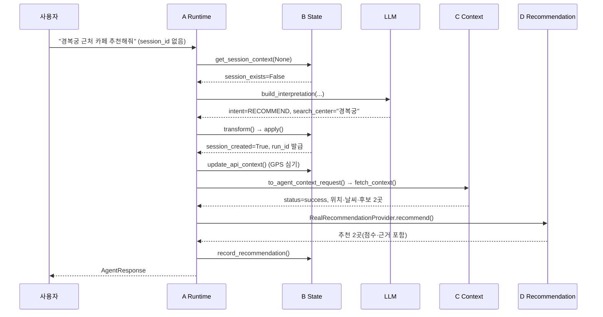
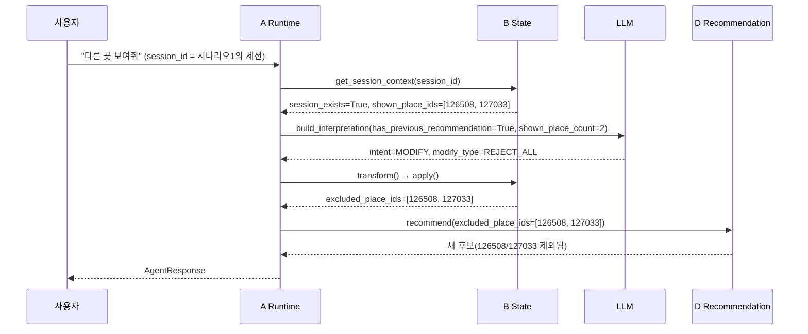

# Agent Runtime 실행 추적 — 시나리오 2건

## 문서 정보

| 항목 | 값 |
|------|-----|
| 버전 | v1 |
| 상태 | Draft |
| 최종 수정 | 2026-07-28 |
| 함께 보기 | 함수별 시그니처·규칙은 [`agent-runtime-contract.md`](./agent-runtime-contract.md)를 참고. 이 문서는 그 계약이 **실제 요청 하나에 대해 어떤 순서로, 어떤 값을 주고받으며** 실행되는지를 추적한다. |

이 문서는 함수 레퍼런스가 아니다. "질문 하나가 들어오면 A가 정확히 무엇을 호출하고,
뭘 받고, 그걸로 뭘 하는지"를 코드 순서 그대로 따라간다. 모든 단계는 이 문서 작성
시점에 실제 코드(`agent_runtime.py`, `state_transform.py`, `context_transform.py`,
`recommendation_transform.py`, `real_recommendation_provider.py`,
`session_orchestrator.py`, `app/state/session.py`)를 다시 읽어 확인한 것이다. 예시
데이터는 `docs/design/a-c-context-contract-draft.md`의 예시(경복궁, place_id
`126508`)와 최대한 맞췄다.

---

## 시나리오 1: "경복궁 근처 카페 추천해줘" (최초 요청)



### [1단계] A → B: 세션 컨텍스트 조회

```python
get_session_context(session_id=None)
```

```json
// 반환: SessionContextResponse
{
  "session_id": null,
  "session_exists": false,
  "has_recommendation": false,
  "recommended_count": 0,
  "shown_place_ids": [],
  "excluded_place_ids": [],
  "user_conditions": { "...14개 필드 전부 null/빈 배열..." },
  "api_context": { "gps_location": null, "api_weather": null, "gps_expired": true, "weather_expired": true },
  "condition_version": 0
}
```

**다음:** `session_exists=False` → 최초 턴으로 처리.

> **참고 — 최초 턴엔 GPS·날씨가 둘 다 안 채워진다.**
> `ensure_current_context()`(`session_orchestrator.py:47`)의 GPS 갱신 분기는
> `context.session_exists`가 참이어야 실행된다. 최초 턴은 세션 자체가 없어서 이
> 분기가 스킵되고, `gps_location`도 `None`이라 62번째 줄에서 **날씨 조회 없이 즉시
> 반환**한다. `AgentRequest.device_location`(디바이스 GPS)을 줘도 최초 턴엔 아무
> 효과가 없다 — [`agent-runtime-contract.md` §2.5](./agent-runtime-contract.md#25-gps-최초-턴-심기-구현-완료-중복-정리는-todo) 참고.

---

### [2단계] A: Intent 분류 + 조건 추출 (LLM 호출)

```python
build_interpretation(
    InterpretRequest(
        user_input="경복궁 근처 카페 추천해줘",
        has_previous_recommendation=False,
        shown_place_count=0,
        current_conditions=None,
    ),
    llm,
)
```

```json
// 반환: LLMOutput
{
  "intent": "RECOMMEND",
  "status": "complete",
  "recommend": {
    "conditions": {
      "current_location": null,
      "search_center": "경복궁",
      "place_types": ["restaurant"],
      "place_tags": ["카페"],
      "weather": null, "weather_intent": null, "transport": null,
      "max_travel_time": null, "time_available": null,
      "environment": null, "companion": null, "budget": null,
      "exclude_tags": [], "special_requirements": []
    }
  }
}
```

**다음:** `status="complete"` → 다음 단계로 진행(needs_clarification이었다면 여기서 응답 종료).

---

### [3단계] A → B: LLMOutput → StateApplyRequest 변환

```python
transform(llm_output, session_context, "경복궁 근처 카페 추천해줘")
```

```json
// 반환: StateApplyRequest
{
  "session_id": null,
  "intent": "RECOMMEND",
  "confirmed": true,
  "reset_scope": "soft",
  "operations": [
    { "op": "Update", "field": "search_center", "value": "경복궁" },
    { "op": "Update", "field": "place_types", "value": ["restaurant"] },
    { "op": "Update", "field": "place_tags", "value": ["카페"] }
  ],
  "rejected_places": [],
  "prompt_version": null
}
```

**다음:** RECOMMEND는 `reset_scope`가 항상 `"soft"`로 고정된다(값이 바뀔 여지 없음) —
[`agent-runtime-contract.md` §2.2](./agent-runtime-contract.md#22-transform).

---

### [4단계] A → B: 조건 병합·세션 생성

```python
apply(apply_request, store=store)
```

```json
// 반환: StateApplyResponse
{
  "session_id": "sess_1785118045133a1b2c3d4e5f",
  "run_id": "run_1785118045133f1e2d3c4b5a",
  "session_created": true,
  "user_conditions": { "search_center": "경복궁", "place_types": ["restaurant"], "place_tags": ["카페"], "...": "나머지 null" },
  "api_context": { "gps_location": null, "api_weather": null, "gps_expired": true, "weather_expired": true },
  "condition_version": 1,
  "condition_changed": true,
  "excluded_place_ids": [],
  "reset_applied": "soft"
}
```

**다음:** `session_created=True` → 4-1단계(GPS 심기) 실행 대상.

> **참고 — 이 응답의 `api_context`는 이번 턴 끝까지 이 값 그대로 간다.**
> 4-1단계에서 GPS를 실제로 저장소에 심지만, `agent_runtime.py`는 `apply()`가 돌려준
> 이 `state_response` 객체를 재조회하지 않고 마지막(8단계)까지 그대로 쓴다. 즉
> **이번 턴 사용자에게 반환되는 `AgentResponse.state.api_context.gps_location`은
> 여전히 `null`**이고, 실제로 GPS가 반영된 상태는 다음 턴 `get_session_context()`
> 부터 보인다. `agent-runtime-contract.md`에는 없던 내용이라 여기서 처음 정리한다.

---

### [4-1단계] A → B: 최초 턴 GPS 심기

```python
update_api_context(
    UpdateApiContextRequest(
        session_id="sess_1785118045133a1b2c3d4e5f",
        gps_location="37.5788,126.9770",
        gps_location_updated_at=<now>,
    ),
    store=store,
)
```

반환값 없음(호출만, 응답 무시). `session_created=True`이고 `device_location`이 유효한
`"위도,경도"` 형식일 때만 실행된다.

**다음:** 5단계로.

---

### [5단계] 분기: Recommendation 단계로 진행할지 판정

```python
llm_output.status is OutputStatus.COMPLETE and llm_output.intent in (Intent.RECOMMEND, Intent.MODIFY)
```

→ `True`(RECOMMEND + complete) → 진행. (`False`였다면 `AgentResponse(recommendations=None)`로 즉시 종료.)

---

### [6단계] A: B의 조건을 A 타입으로 변환

```python
agent_conditions = to_user_conditions(state_response.user_conditions)
```

```json
{ "search_center": "경복궁", "place_types": ["restaurant"], "place_tags": ["카페"], "...": "나머지 null" }
```

차이는 타입뿐이다(B는 순수 문자열, A는 `PlaceType`/`PlaceTag` enum) — 값은 동일.

---

### [7단계] A → C: Context 요청 조립

```python
to_agent_context_request(request_id=new_trace_id(), conditions=agent_conditions)
```

```json
// 반환: AgentContextRequest
{
  "request_id": "trace_1785118045133112233445566",
  "intent": "RECOMMEND",
  "conditions": {
    "current_location": null, "search_center": "경복궁",
    "place_types": ["restaurant"], "place_tags": ["카페"],
    "weather": null, "weather_intent": null, "transport": null,
    "max_travel_time": null, "time_available": null,
    "environment": null, "companion": null, "budget": null,
    "exclude_tags": [], "special_requirements": []
  }
}
```

> **참고 — `search_radius_km`이 여기 없다.** C는 이 값을 A에게 안 받고
> `conditions.max_travel_time`으로 자체 계산한다(`_resolve_search_radius_km()`) —
> [`agent-runtime-contract.md` §4.1](./agent-runtime-contract.md#41-to_search_radius_km) 참고.

---

### [8단계] A → C: 실제 Context 조회

```python
tool_provider.fetch_context(context_request)  # ContextService.fetch_context()
```

```json
// 반환: AgentContextResponse (status=success 가정)
{
  "request_id": "trace_1785118045133112233445566",
  "intent": "RECOMMEND",
  "contract_version": "draft-v0",
  "status": "success",
  "context": {
    "location": {
      "status": "success",
      "data": { "requested_query": "경복궁", "resolved_name": "경복궁", "location": { "latitude": 37.5796, "longitude": 126.9770 }, "address": "서울특별시 종로구" }
    },
    "weather": {
      "status": "success",
      "data": { "condition": "good", "forecast_for": "2026-07-28T14:00:00+09:00", "temperature_celsius": 27.5 }
    },
    "places": {
      "status": "success",
      "data": [
        { "place_id": "126508", "name": "경복궁 근처 카페", "category": "restaurant", "location": { "latitude": 37.5800, "longitude": 126.9775 }, "operating_hours_raw": "09:00~22:00" },
        { "place_id": "127033", "name": "고궁 카페", "category": "restaurant", "location": { "latitude": 37.5790, "longitude": 126.9760 }, "operating_hours_raw": "10:00~20:00" }
      ]
    },
    "holidays": { "status": "no_data", "data": [] }
  },
  "warnings": [],
  "error": null,
  "metadata": { "rule_versions": { "search_radius": "walking-radius-v1" }, "provider_metadata": [] }
}
```

**다음:** `status="success"` → `_TOOL_TERMINAL_STATUSES`(needs_clarification/unsupported/unavailable)에
안 걸림 → D 단계로 진행.

---

### [9단계] A: D에 넘길 검색 반경 계산

```python
to_search_radius_km(agent_conditions)  # max_travel_time=None
```

```
반환: 2.0  (기본값 — max_travel_time이 없을 때)
```

> **참고 — 이 값은 C가 8단계에서 이미 쓴 반경과 "같은 공식으로 각자 계산"한
> 값이지, C 응답에서 받아온 값이 아니다.** `max_travel_time=None`이라 A도
> C도 각자의 기본값(둘 다 2.0km로 하드코딩)을 쓴 것 — 우연히 같은 상수라
> 일치했을 뿐 구조적으로 보장된 게 아니다. [`agent-runtime-contract.md`
> §8](./agent-runtime-contract.md#8-미해결-이슈-종합)의 미해결 이슈.

---

### [10단계] A → D: 추천 실행

```python
recommendation_provider.recommend(agent_conditions, tool_context, excluded_place_ids=[])
# 내부: run_recommendation_pipeline_from_context(context, visit_at=<KST now>, search_radius_km=2.0,
#       shown_place_ids=frozenset(), recommendation_limit=5)
```

```json
// 반환: RecommendationResponse
{
  "recommendations": [
    {
      "place_id": "126508", "name": "경복궁 근처 카페", "category": "restaurant",
      "distance_km": 0.35, "remaining_minutes": 480, "environment_type": "indoor",
      "recommendation_reason": "거리·날씨·운영시간 조건을 종합한 1순위 추천이에요.",
      "explanations": [
        "현재 위치에서 직선거리 약 350m예요.",
        "맑은 날씨에 적합한 실내 장소예요."
      ],
      "warnings": [],
      "score": 0.86,
      "feature_scores": { "weather": 0.7, "remaining_operating_time": 1.0, "distance": 0.83 },
      "weights_used": { "weather": 0.4, "remaining_operating_time": 0.4, "distance": 0.2 }
    },
    {
      "place_id": "127033", "name": "고궁 카페", "category": "restaurant",
      "distance_km": 0.9, "remaining_minutes": 120, "environment_type": "indoor",
      "recommendation_reason": "거리·날씨·운영시간 조건을 종합한 2순위 추천이에요.",
      "explanations": ["맑은 날씨에 적합한 실내 장소예요."],
      "warnings": [],
      "score": 0.71,
      "feature_scores": { "weather": 0.7, "remaining_operating_time": 1.0, "distance": 0.55 },
      "weights_used": { "weather": 0.4, "remaining_operating_time": 0.4, "distance": 0.2 }
    }
  ],
  "unverified_recommendations": [],
  "elapsed_ms": 42.3
}
```

**다음:** `excluded_place_ids=[]`라 두 후보 다 그대로 노출됨 → 기록 단계로.

> **참고 — `RealRecommendationProvider`가 아직 실제로 이 자리에 들어가 있지
> 않다.** `run_agent()`(팩토리 진입점)는 지금도 `recommendation_provider=
> FakeRecommendationProvider()`를 그대로 쓴다. 이 시나리오는 `RealRecommendationProvider`가
> 연결됐다고 가정한 "설계상 완성된 흐름"이다 — [`agent-runtime-contract.md`
> §8](./agent-runtime-contract.md#8-미해결-이슈-종합) 참고.

---

### [11단계] A → B: 노출 결과 기록

```python
record_recommendation(
    RecordRecommendationRequest(
        session_id="sess_1785118045133a1b2c3d4e5f",
        run_id="run_1785118045133f1e2d3c4b5a",
        recommended=[
            RecommendedPlace(place_id="126508", rank=1),
            RecommendedPlace(place_id="127033", rank=2),
        ],
    ),
    store=store,
)
```

```json
{ "recorded": 2 }
```

> **참고 — 이 인라인 로직은 `to_record_recommendation_request()`와 결과는
> 같지만, 실제로 그 함수를 호출하지 않는다.** `agent_runtime.py` 7단계가 같은
> rank 계산(recommendations + unverified_recommendations를 배열 순서대로 1부터)을
> 직접 수행한다 — `to_record_recommendation_request()`는 정의만 돼 있고 미사용
> 상태다. [`agent-runtime-contract.md` §4.4](./agent-runtime-contract.md#44-db-노출-결과-기록) 참고.

---

### [12단계] (참고) A: 자연어 문장 조립 — 이번 흐름엔 없음

```python
compose_recommendation_message(item)  # item = recommendations[0]
```

```
반환: "현재 위치에서 직선거리 약 350m예요. 맑은 날씨에 적합한 실내 장소예요."
```

> **참고 — `run_agent_flow()`는 이 함수를 호출하지 않는다.** `AgentResponse`에는
> `RecommendationItem` 목록(explanations/warnings 분리된 채)만 담기고, 사용자에게
> 보여줄 문장으로 합치는 건 `run_agent_flow()` 바깥의 몫이다(프론트가 직접
> 조립하거나, 별도 응답 조립 레이어가 나중에 이 함수를 호출하거나 — 아직 호출
> 지점이 없다). 이 단계는 "존재하는 함수를 넣으면 이런 값이 나온다"는 참고용이지
> 실제 실행 순서의 일부가 아니다.

---

### [13단계] A: 최종 `AgentResponse` 조립

```json
{
  "llm_output": { "intent": "RECOMMEND", "status": "complete", "recommend": { "...": "2단계 값 그대로" } },
  "state": { "session_id": "sess_...", "run_id": "run_...", "session_created": true, "api_context": { "gps_location": null, "...": "4단계 참고 — GPS는 저장은 됐지만 이 필드엔 반영 안 됨" } },
  "recommendations": { "recommendations": [ "...10단계 2건..." ], "unverified_recommendations": [], "elapsed_ms": 42.3 }
}
```

시나리오 1 종료.

---

## 시나리오 2: (같은 세션) "다른 곳 보여줘"



같은 함수를 같은 순서로 부르되, 값이 달라지는 지점만 짚는다. 언급 없는 단계는
시나리오 1과 동일하다.

### [1단계] A → B: 세션 컨텍스트 조회 (차이점)

```python
get_session_context(session_id="sess_1785118045133a1b2c3d4e5f")
```

```json
{
  "session_id": "sess_1785118045133a1b2c3d4e5f",
  "session_exists": true,
  "has_recommendation": true,
  "recommended_count": 2,
  "shown_place_ids": ["126508", "127033"],
  "excluded_place_ids": ["126508", "127033"],
  "user_conditions": { "search_center": "경복궁", "place_types": ["restaurant"], "place_tags": ["카페"], "...": "시나리오1과 동일" },
  "api_context": { "gps_location": "37.5788,126.9770", "api_weather": null, "gps_expired": false, "weather_expired": true },
  "condition_version": 1
}
```

> **참고 — GPS는 이제 실려 있고(`gps_expired=false`), 날씨는 여전히 비어 있다
> (`weather_expired=true`).** `API_CONTEXT_TTL`(1시간, `app/state/session.py:20`)이
> GPS·날씨 둘 다에 동일하게 적용되는데, GPS는 시나리오1의 4-1단계에서 막 심어져서
> `gps_expired=False`이고, 날씨는 시나리오1에서 **한 번도 조회된 적이 없어서**
> (1단계 참고 — 최초 턴은 GPS 없이 조기 반환돼 날씨 자체를 안 부름) 여전히 만료
> 상태다. → 이번 턴 `ensure_current_context()`가 **날씨를 처음으로 조회한다.**

**다음:** `session_exists=True` → GPS 갱신 분기는 `gps_expired=False`라 스킵, 날씨
갱신 분기는 `weather_expired=True`라 실행(`_refresh_weather()` 호출, `api_context.
gps_location`의 좌표로 조회).

---

### [2단계] A: Intent 분류 + 조건 추출 (차이점)

```python
build_interpretation(
    InterpretRequest(
        user_input="다른 곳 보여줘",
        has_previous_recommendation=True,
        shown_place_count=2,
        current_conditions=to_user_conditions(session_context.user_conditions),
    ),
    llm,
)
```

```json
{
  "intent": "MODIFY",
  "status": "complete",
  "modify": { "modify_type": "REJECT_ALL", "condition_changes": null, "changed_fields": [] }
}
```

**다음:** `has_previous_recommendation=True` + "다른 곳" 표현 → MODIFY/REJECT_ALL로
판정(최초 턴이었다면 같은 문구도 RECOMMEND로 처리됨 — 맥락 의존 판별).

---

### [3단계] A → B: 변환 (차이점)

```python
transform(llm_output, session_context, "다른 곳 보여줘")
```

```json
{
  "session_id": "sess_1785118045133a1b2c3d4e5f",
  "intent": "MODIFY",
  "confirmed": true,
  "reset_scope": null,
  "operations": [],
  "rejected_places": [
    { "place_id": "126508", "reason_code": "not_interested" },
    { "place_id": "127033", "reason_code": "not_interested" }
  ],
  "prompt_version": null
}
```

**다음:** REJECT_ALL → `rejected_places`에 직전 노출 전체가 `reason_code=
"not_interested"`로 기록됨. `reset_scope`는 phrase 매칭이 없어 `None`(REJECT_ALL은
`history` 기본값 대상이 아님 — CHANGE_CONDITION만 그렇다).

---

### [4단계] A → B: 조건 병합 (차이점)

```python
apply(apply_request, store=store)
```

```json
{
  "session_id": "sess_1785118045133a1b2c3d4e5f",
  "run_id": "run_1785118050231a9b8c7d6e5f",
  "session_created": false,
  "user_conditions": { "search_center": "경복궁", "place_types": ["restaurant"], "place_tags": ["카페"], "...": "REJECT_ALL은 조건을 안 건드림 — KEEP" },
  "condition_version": 1,
  "condition_changed": false,
  "excluded_place_ids": ["126508", "127033"],
  "reset_applied": null
}
```

**다음:** `session_created=False` → 4-1단계(GPS 심기)는 이번엔 스킵. `excluded_place_ids`에
시나리오 1의 두 place_id가 들어감(`recommended`에 있었으므로) — REJECT_ALL로
`rejected`에도 같은 두 id가 추가됐지만, 이미 `recommended`만으로도 제외 대상이라
결과 집합은 동일하다.

---

### [6~9단계] A → C → D (요약)

`agent_conditions`는 시나리오 1과 값이 같다(REJECT_ALL은 조건을 안 바꿈) → C 요청도
동일 → C 응답도 (이 예시에서는) 동일 후보 2곳을 그대로 돌려준다고 가정한다.

---

### [10단계] A → D: 추천 실행 (차이점)

```python
recommendation_provider.recommend(agent_conditions, tool_context, excluded_place_ids=["126508", "127033"])
# 내부: run_recommendation_pipeline_from_context(..., shown_place_ids=frozenset({"126508", "127033"}), ...)
```

```json
{
  "recommendations": [],
  "unverified_recommendations": [],
  "elapsed_ms": 15.1
}
```

**다음:** C가 이 예시에서 후보 2곳만 반환했고 둘 다 `shown_place_ids`에 있어
`score_candidates()`의 하드 필터(`_is_excluded`)에서 전부 제외됨 → 빈 결과.
(실제 상황에서는 C가 반경 안의 **다른** 카페까지 더 폭넓게 반환하므로 보통은 빈
결과가 아니라 새 후보가 나온다 — 이 예시는 "제외가 실제로 동작한다"는 걸 보여주기
위해 후보 풀을 시나리오 1과 동일하게 고정했을 뿐이다.)

---

### [11단계] A → B: 노출 결과 기록 (차이점)

```python
shown = [*recommendations.recommendations, *recommendations.unverified_recommendations]  # = []
if shown:  # False
    record_recommendation(...)  # 호출 안 됨
```

**다음:** 노출된 게 없으면 `record_recommendation()` 자체를 호출하지 않는다(빈 목록
기록 방지).

---

## 한눈에 비교

| 단계 | 시나리오 1 (최초) | 시나리오 2 (REJECT_ALL) |
|---|---|---|
| 1. `get_session_context()` | `session_exists=False` | `session_exists=True`, `shown_place_ids=[126508, 127033]` |
| 1-1. GPS/날씨 갱신 | 둘 다 스킵(세션 없음) | GPS는 스킵(아직 안 만료), **날씨는 이번에 처음 조회** |
| 2. LLM 판정 | RECOMMEND | MODIFY / REJECT_ALL |
| 3. `transform()` | `reset_scope="soft"`, `rejected_places=[]` | `reset_scope=None`, `rejected_places`=직전 노출 2곳(`not_interested`) |
| 4. `apply()` | `session_created=True`, `condition_changed=True` | `session_created=False`, `condition_changed=False` |
| 4-1. GPS 심기 | 실행됨(최초 턴) | 스킵(`session_created=False`) |
| 9. `to_search_radius_km()` | `2.0`(기본값) | `2.0`(조건 안 바뀜 — 동일) |
| 10. D 호출 `excluded_place_ids` | `[]` | `["126508", "127033"]` |
| 10. D 결과 | 후보 2곳 노출 | 두 곳 다 제외 → 빈 결과(이 예시 한정) |
| 11. `record_recommendation()` | 호출됨(2건 기록) | **호출 안 됨**(노출된 게 없어서) |

---

## 이 문서에서 생략한 것

- **LLM 단계 `needs_clarification` 경로**(예: "눈 오는데 카페 추천해줘" — weather_intent
  모호) — `agent-runtime-contract.md` §2.2의 규칙표까지만 다루고, 실제 추적은 여기 없음.
- **C 단계 자체의 `needs_clarification`/`unsupported`/`unavailable`** — 상태별 처리
  규칙은 [`agent-runtime-contract.md` §3.3](./agent-runtime-contract.md#33-c-응답agentcontextresponse-status별-처리)
  참고.
- **INFO/COMPARE/GENERAL/OUT_OF_SCOPE 경로** — Tool/Recommendation을 건너뛰고
  바로 종료되는 것만 확인됐고, 이 문서는 RECOMMEND/MODIFY 흐름만 추적한다.
- **혼잡률(concentration) 보강** — 아직 A 쪽 구현이 없다(설계만 됨) —
  [`agent-runtime-contract.md` §6](./agent-runtime-contract.md#6-혼잡률concentration-보강--설계만-미구현-todo)
  참고.
