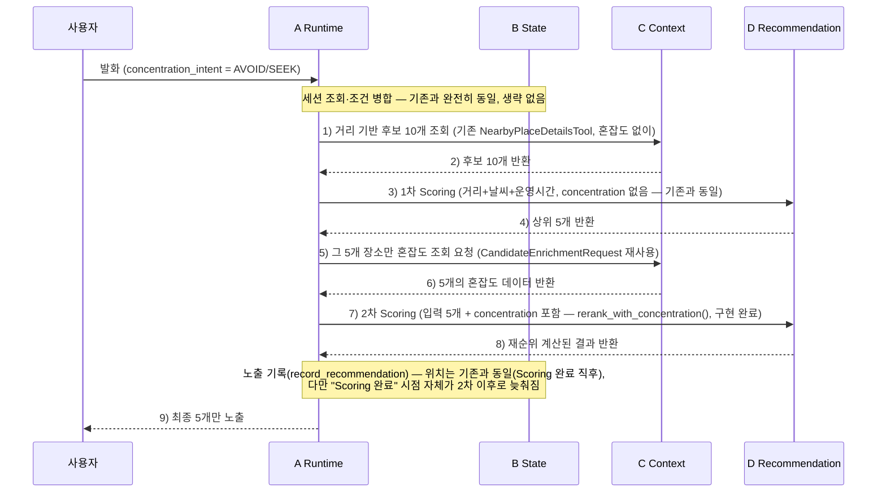

# 혼잡도(Concentration) 조건 설계

## 문서 정보

| 항목 | 값 |
|------|-----|
| 버전 | v0.6 |
| 상태 | 초안 (Draft) — §2.2/§2.3 D 확인 완료(D-040, 안 B 채택·구현 완료) |
| 최종 수정 | 2026-08-02 |
| 소유 | A (Agent Runtime) |
| 관련 코드 | `backend/app/concentration_policy.py`, `backend/app/domain/scoring.py`, `backend/app/agent_context/enrichment_service.py`, `backend/app/state/field_spec.py` |

---

## 1. 목적과 배경

관광지 혼잡도를 사용자에게 노출하는 요청은 형태가 다른 두 가지로 들어온다.

1. **여러 후보 중에서** 혼잡도 방향을 반영해 추천해달라는 요청 — "핫한 관광지 어디야", "조용한 공원 추천해줘"
2. **특정 장소 하나**의 혼잡도를 묻는 요청 — "이번 주말 창덕궁 사람 많을까?"

전자는 여러 후보를 비교·정렬하는 문제이므로 RECOMMEND의 조건(Condition) 확장으로,
후자는 단일 장소에 대한 질의응답이므로 INFO의 질문 유형(`question_type`) 확장으로
각각 처리한다. 판별 복잡도와 응답 속도를 이유로 별도의 Intent는 만들지 않는다
([intent-definition.md](./intent-definition.md) 판별 규칙 재사용).

데이터 소스는 **한국관광공사 관광지 집중률 예측 API**(`get_concentration` Tool,
[tool-intelligence-contract-v1.md §6.5](./tool-intelligence-contract-v1.md#65-get_concentration))만
우선 사용한다. 서울시 실시간 혼잡도 API(카페·음식점 등 업종별 실시간 데이터)는
이번 범위 밖이며 §8에 TODO로 남긴다.

이 문서가 다루지 않는 것: `place_types`/`place_tags` 등 기존 Conditions 필드의
전체 정의(→ [conditions-schema.md](./conditions-schema.md) 소유), Scoring 가중치
공식의 상세 정의(→ [recommendation-scoring.md](./recommendation-scoring.md), D-040 확정).

---

## 2. RECOMMEND 확장 — `concentration_intent`

### 2.1 필드 정의

`UserConditions`에 15번째 필드로 추가한다. `weather_intent`와 완전히 동일한 패턴이다.

```typescript
concentration_intent: "AVOID" | "SEEK" | "IGNORE" | null;
```

| 값 | 의미 | 예시 입력 | 추천 정책 |
|----|------|-----------|-----------|
| `AVOID` | 혼잡한 곳을 피하고 싶음 | "조용한 공원 추천해줘", "한적한 곳 가고싶어", "사람 없는 데" | `concentration` Feature: 집중률 낮을수록 고득점 |
| `SEEK` | 혼잡한(인기 있는) 곳을 원함 | "핫한 관광지 어디야", "인기 많은 곳 추천해줘", "사람 많고 북적이는 데" | `concentration` Feature: 집중률 높을수록 고득점 |
| `IGNORE` | 혼잡도 무관 | 혼잡도 관련 언급 없음 | `concentration` 가중치 제외 (재분배) |
| `null` | 판별 불가 | 혼잡도 관련 단어는 있으나 방향이 모호함 (드묾) | `IGNORE`와 동일하게 처리 |

**`weather_intent`와의 차이점**: `weather_intent`의 `null`은 `environment`(indoor/outdoor)
하드 필터를 결정하지 못해 사용자에게 추가 질문을 한다
([int-01-recommend.md §8](./int-01-recommend.md#8-weather_intent-판별)). `concentration_intent`는
하드 필터에 관여하지 않고 Scoring 가중치에만 영향을 주므로, `null`도 `IGNORE`와 동일하게
가중치만 제외하고 **추가 질문 없이 진행**한다 — concentration은 순위 조정용 Feature일
뿐 후보군 자체를 바꾸지 않기 때문이다.

### 2.2 데이터 확보 시점 — ✅ D-040 확정 (2026-08-02)

> **2026-08-02 D 확인 완료.** C와 협의한 흐름을 D가 확인하고 2.2.3의 "2차
> Scoring"(D에 없던 신규 인터페이스, `rerank_with_concentration()`)까지 실제
> 구현했다(`docs/decision-log.md` D-040). 아래 §2.2/§2.3 본문은 이제 확정
> 사실을 서술한다.

#### 2.2.1 v0.4까지의 결론 (재검토 후 폐기, 안 A로 대안 유지)

v0.4는 "concentration이 순위에 반영되는 이상 post-ranking 보강(기존
`CandidateEnrichmentRequest`/`Response`)은 못 쓰고, 초기 Context 요청 단계에서
지역 전체를 한 번에 받아와야 하며 D는 1회만 호출된다"고 결론 냈었다. **이
결론은 아래 2.2.2의 실측 결과로 재검토돼 안 B로 대체됐다** — `concentration_intent`가
`AVOID`/`SEEK`일 때 한정이며, `null`/`IGNORE`일 때는 이 재검토와 무관하게
기존처럼 D 1회 호출로 끝난다(변경 없음). v0.4 안(초기 Context 확장)은
폐기하지 않고 [agent-runtime-contract.md §6.5.1](./agent-runtime-contract.md#651-안-a--초기-context-요청에-포함-d는-1회만-호출-v04-결론-대안으로-유지)의
대안으로 유지한다.

#### 2.2.2 재검토 배경 — 실측 성능 비교

세션 중 실제 Real Provider로 직접 측정한 결과다.

| 조회 방식 | 소요 시간 | 비고 |
|---|---|---|
| 장소 후보 10개 검색(`NearbyPlaceDetailsTool`) | **약 3.0초** | RECOMMEND가 이미 매 실행마다 하는 일 |
| 집중률 — 종로구 전체(113곳) 병렬 페이지 조회 | **약 3.5초** | 20페이지, `asyncio.gather()` |
| 집중률 — 종로구 전체 순차 페이지 조회 | **약 11.8초** | 20페이지 순차 — `numOfRows=100` 하드코딩이라 페이지네이션 필수 |
| 집중률 — 장소 1곳 `tAtsNm` 지정 조회 | **약 0.12초** | TourAPI가 서버에서 필터링, payload 작음 |

즉 "후보 검색 전에 지역 전체 집중률부터 미리 받아두자"는 v0.4 설계는 이미
후보 검색에만 3초가 드는 실행에 지역 전체 조회(병렬이어도 3.5초)를 얹어 총
6.5초 이상으로 늘린다 — 실측 결과 이득이 없었다. 반면 "이미 좁혀진 소수
후보만 개별 조회"하면 건당 0.12초로 압도적으로 빠르다. 이게 아래 9단계
제안의 근거다.

#### 2.2.3 확정 흐름 — 9단계



`concentration_intent`가 `null`/`IGNORE`일 때는 이 9단계를 타지 않고 기존
그대로 **A→C→A→D→A**(D 1회 호출)로 끝난다 — 이 경우는 흐름이 전혀 안 바뀐다.

**1차/2차 D 호출의 입력 모양 차이 (흐릿하게 쓰지 않는다)**:

| | 입력 후보 수 | concentration 포함 여부 | 비고 |
|---|---|---|---|
| **1차 Scoring** | 10개 | 없음 | 기존 `RealRecommendationProvider.recommend()` → `score_candidates()`와 시그니처·동작 완전히 동일 — **새로 만들 것 없음** |
| **2차 Scoring** | **5개**(1차 상위 결과) | **있음** | "같은 10개를 다시 채점"이 아니라 **후보 집합 자체가 5개로 좁혀진 뒤 새 Feature가 추가된 재채점** — `rerank_with_concentration()`으로 구현 완료(D-040) |

**B(State)의 위치는 기존 구조에서 벗어나지 않는다**: 실제
`run_agent_flow()`의 순서(1.세션조회(B) 2.LLM 해석 3.조건병합(B) 4.게이트
5.초기 후보조회(C) 6.Scoring(D) 7.노출 기록(B, `record_recommendation()`)
8.최종 응답) 중 6)이 "6a.1차 Scoring(D) → 6b.집중률 조회(C) → 6c.2차
Scoring(D)"로 늘어날 뿐, 7)의 위치·역할은 그대로다 — 다만 7)이 기록하는
대상이 "1차 Scoring 직후"가 아니라 "6c 2차 재순위 계산이 끝난 뒤, 최종
5개로 자른 결과"로 바뀐다(`_CONCENTRATION_FINAL_LIMIT = 5`, 2026-08-02 기획
확정 — 1차가 애초에 최대 5개까지만 넘기므로 이 슬라이싱은 현재 사실상
no-op이나, 1차 개수가 나중에 바뀔 경우를 대비한 방어 코드로 유지한다). 1)~5)와
8)은 전혀 안 바뀐다.

**A→C 연결 계획 — C가 이미 만들어둔 것 재사용 (확정, 연결 완료)**:

C 쪽은 전부 이미 구현돼 있어 새로 만들 필요가 없다.

1. `GetConcentrationTool`(`app/tools/concentration.py`) +
   `RealConcentrationProvider`/`FakeConcentrationProvider`
   (`app/providers/concentration.py`)
2. `CandidateEnrichmentService.enrich(request)`
   (`app/agent_context/enrichment_service.py`) — 이미 소수 후보를 병렬로
   집중률 조회하는 서비스가 완성돼 있음
3. `get_candidate_enrichment_service(client)`(`app/agent_context/factory.py`) —
   위 서비스를 조립하는 팩토리, A가 이걸로 그대로 주입받으면 됨
4. (신규, develop 병합분) `place_concentration_mappings` 테이블 — §4.4 참고,
   아직 `enrichment_service.py`에는 연결 안 됨

A가 새로 설계·구현 완료한 연결 지점:

1. D 1차 결과(`RankedCandidate`, `place_id`/`name`만 있고 위도·경도 없음)를
   원본 `context.places`(위도·경도 있음)와 `place_id`로 재조인해서
   `CandidateEnrichmentTarget` 리스트를 만드는 변환 함수 — 예전
   [agent-runtime-contract.md §6.4](./agent-runtime-contract.md)에 이름만
   미리 정해뒀던 `to_candidate_enrichment_request()`를 되살려 구현했다.
2. `EnrichmentProvider` Protocol(§6.4에 이미 시그니처가 예정돼 있던
   `async def enrich(request) -> CandidateEnrichmentResponse`) — C의
   `CandidateEnrichmentService.enrich()`가 이미 이 모양을 만족해 그대로
   연결했다.
3. `CandidateEnrichmentResponse`(5개의 집중률 데이터)를 D의 2차 Scoring
   입력으로 바꾸는 별도 변환 함수는 만들지 않았다 — D의
   `rerank_with_concentration()`이 `CandidateEnrichmentResponse`를 그대로
   받아 내부에서 `place_id`로 매핑하는 구조로 확정됐기 때문이다.

**기존 `CandidateEnrichmentRequest`/`Response`(post-ranking, 상위 5개 한정)를
"이번 용도에 안 맞는다"고 봤던 v0.4 판단은 폐기됐다.** 순위 계산 *전에*
데이터가 있어야 한다는 전제 자체가, "순위 계산을 1차/2차로 나눈다"는 안 B로
바뀌었기 때문이다 — 이 계약을 그대로 재사용하는 쪽으로 확정됐다.

### 2.3 Scoring 반영 개요 — ✅ D-040 확정 (1차/2차 구조)

D의 Scoring(`backend/app/domain/scoring.py`)에 `concentration` Feature를
추가한다는 목표대로 구현 완료됐다. 상세 가중치 공식은
[recommendation-scoring.md](./recommendation-scoring.md) §4.4/§5.1/§5.2에
"D-040 확정"으로 반영돼 있다(D 소유 문서).

- `concentration_intent`가 `null`/`IGNORE`면 2차 Scoring 자체를 실행하지
  않는다(1차 결과를 그대로 최종 결과로 쓴다) — 기존 `redistribute_weights()`
  결측 재분배 경로를 탈 필요조차 없다.
- `concentration_intent`가 `AVOID`/`SEEK`면: 1차 Scoring(10개, 기존 3-Feature
  그대로) → 상위 5개 추출 → 그 5개에 한해 2차 Scoring(5개, weather+
  remaining_operating_time+distance+**concentration** 4-Feature)을 수행한다.
  1차에는 concentration이 아예 존재하지 않는 Feature라는 점이 기존 weather/
  remaining_operating_time(둘 다 매 실행 계산 시도)과 다르다 — `domain/
  evidence.py`가 1차용 `_FEATURE_ORDER`(3-Feature)와 2차용
  `CONCENTRATION_FEATURE_ORDER`(4-Feature)를 분리해서 이 구분을 반영한다.
- C가 5단계 응답으로 돌려주는 `concentration_rate`(0~100대 상대 비율)를 0~1
  점수로 변환하는 공식은 **선형 정규화**로 확정했다(4단계 구간 매핑 대신
  distance/remaining_operating_time과 같은 연속값 스타일 유지·정보 손실
  회피 목적, `domain/scoring.py::concentration_score()`).
- 5개 중 일부 후보에 concentration 값이 없으면(집중률 데이터셋에 없음)
  weather/remaining_operating_time과 동일하게 **후보별 개별 결측**으로
  처리한다(해당 후보만 concentration 가중치 재분배).
- **D 신규 인터페이스 구현 완료**: `score_candidates()`는 단일 호출만
  지원했지만(`recommendation_pipeline.py`가 정확히 1회 호출), D가
  `rerank_with_concentration()`을 신규로 추가해 "이미 뽑힌 부분집합을 다시
  채점하는" 2차 호출 진입점을 확보했다.

---

## 3. INFO 확장 — `question_type: "concentration"`

### 3.1 정의

[int-02-info.md §6](./int-02-info.md#6-question_type-정의) enum에 추가한다.

| `question_type` | 정의 | 예시 입력 | 필요 API |
|---|---|---|---|
| `concentration` | 특정 장소/지역의 방문객 혼잡도 예측 | "사람 많아?", "붐빌까?", "혼잡해?" | `get_concentration` (집중률 API) |

### 3.2 `visit_time` 필드

`InfoQuery`에 선택 필드를 추가한다 (`question_type === "concentration"`일 때만 사용,
다른 유형에는 쓰지 않음):

```typescript
visit_time: string | null;  // YYYY-MM-DD, concentration 질의 전용
```

**파싱 규칙**: "오늘"/명시 없음 → 오늘 날짜, "내일" → 내일 날짜, "이번 주말" → 돌아오는
토/일 중 가까운 날, "8월 3일"처럼 특정 날짜 언급 → 해당 날짜로 정규화.

**데이터 범위 (정정)**: TourAPI 집중률 예측은 **오늘부터 향후 약 30일치**를 제공한다.
`FakeConcentrationProvider`(`backend/app/providers/concentration.py:91`)는 테스트
편의상 어제/오늘/내일 3일치만 반환하도록 단순화돼 있어 실제 API 범위를 대표하지
않는다 — `visit_time`이 오늘+2일 이상인 시나리오를 테스트하려면 Fake를 확장하거나
별도 Fixture가 필요하다(§8 TODO). "이번 주말"처럼 30일 이내의 요청은 정상 지원
범위이며, 30일을 넘는 날짜는 API가 예측치를 갖고 있지 않으므로 `no_data`로 처리하고
§7의 fallback 문구를 사용한다.

장소 식별 로직은 기존 `place_context`(`explicit`/`from_recommendation`/
`from_conversation`, [int-02-info.md §5](./int-02-info.md#5-place_context-정의))를
그대로 재사용한다.

### 3.3 목적지 인근 관광지 대체 조회 (근접치 Fallback)

"용리단길 카페 사람 많을까?", "명동 식당 웨이팅 있을까?"처럼 집중률 API가 다루는
"관광지" 콘텐츠에 없는 개별 상점(카페·음식점 등)을 물으면, 그 상점 자체의 집중률은
구할 수 없다. 이 경우 목적지 질문 자체를 포기하지 않고 **목적지 근처의 가장 가까운
관광지 집중률로 대체 조회**해 참고 정보로 제공한다. (`decision-log.md` 하단 상태표의
미결 항목 "혼잡도 fallback: 장소 근접치·구 단위·Feature 제외" 중 **장소 근접치**
안을 채택하는 결정이다 — `decision-log.md` D-036으로 반영했다.)

**흐름:**

```
1. place_context로 대상 장소(예: "OO카페") 식별, 좌표 확보 (기존 로직 재사용)
2. get_concentration(place_name="OO카페", ...) 호출
3. status == "success" → 그대로 응답
4. status == "no_data" →
   a. search_nearby_places(location=대상 좌표, place_types=["attraction"], radius_km=0.5, limit=1)
      로 가장 가까운 관광지 탐색 (기존 Tool 재사용 — `NearbyPlaceDetailsTool`,
      backend/app/tools/nearby_place_details.py, tool-intelligence-contract-v1.md §6.2)
   b. 결과 있음 → 그 관광지 이름으로 get_concentration 재호출
      → 성공 시 "대체 조회"임을 명시해 응답
      → 그마저 no_data면 c로
   c. 결과 없음(반경 내 관광지 없음) 또는 대체 조회도 no_data → 순수 "데이터 없음" 응답
5. status == "unavailable" (API 장애) → 대체 조회로 넘기지 않고 일반 오류로 처리한다
   (데이터 커버리지 문제가 아니라 API 장애이므로 fallback으로 가릴 문제가 아니다)
```

**응답 원칙**: 대체 조회로 얻은 값은 반드시 "정확한 [상점명] 데이터가 아니라 인근
관광지 기준 추정"이라는 것을 명시한다.

> "OO카페 자체의 혼잡도 데이터는 없지만, 가장 가까운 관광지인 [명소명] 기준으로는
> 오늘 다소 혼잡한 편이에요. 비슷한 수준일 가능성이 있어요."

절대 "OO카페가 혼잡해요"처럼 대상 장소 자체의 값인 것처럼 단정하지 않는다 — 항상
"근처 [관광지] 기준" 문구를 포함한다.

**탐색 반경(`radius_km`)**: 기본값은 0.5km다. `search_nearby_places`의
시스템 기본값(`place_search_policy.py`의 `DEFAULT_PLACE_SEARCH_RADIUS_KM`)은
2.0km이지만, "근처 관광지"로 참고할 수 있는 신뢰도를 위해 이 fallback 전용으로는
더 좁게 잡는 게 안전하다고 판단했다. `concentration_policy.py`의
`INFO_CONCENTRATION_FALLBACK_RADIUS_KM`을 단일 기준으로 사용하며, 실제 테스트 결과에
따라 조정한다. "관광지가 너무 멀면 대체 조회 자체를 포기할지"는 C/D와 함께 확정 필요(§8 TODO).

**✅ 2026-08-02 D 확인 완료 — RECOMMEND 쪽은 적용하지 않는다.** 이 절은
**INFO(단일 장소 질의)로 범위를 한정**한다. RECOMMEND에서는 직접 조회된 혼잡도만 사용하며,
근접치 fallback은 적용하지 않는다. 후보당 API 호출 증가와 추정치 순위 반영 위험 때문에
D가 RECOMMEND 확장을 보류했다. C 구현은 INFO의 `ContextService.fetch_info_context()`에만
필요하다.

---

## 4. Concentration API 요청 필드 설계

### 4.1 현재 구현된 요청 필드 (코드 확인)

Tool 계층(`ConcentrationQuery`, `backend/app/tools/concentration.py`)과 실제
TourAPI 호출(`RealConcentrationProvider`, `backend/app/providers/concentration.py`)을
조사한 결과는 다음과 같다.

| 필드 | 계층 | 필수 여부 | 비고 |
|---|---|---|---|
| `area_code` | Tool 요청 (`areaCd`) | 필수 (`ConcentrationQuery.__post_init__`에서 공백 검증) | 시도 코드 |
| `district_code` | Tool 요청 (`signguCd`) | 필수 (동일 검증) | 시군구 코드 |
| `place_name` | Tool 요청 (`tAtsNm`) | 선택 | 응답 필터링용 |
| 날짜 | 없음 | — | **API 요청 자체엔 날짜 파라미터가 없다.** 지역 코드로만 조회하면 API가 다중 날짜 예측치(향후 약 30일, §3.2)를 한 번에 반환하고, 원하는 날짜는 응답을 받은 뒤 클라이언트(C)가 직접 선택한다. |

**중요 발견 — `area_code`/`district_code`는 이미 종로구로 고정돼 있다.**
`enrichment_service.py`의 `_JONGNO_AREA_CODE`("11")/`_JONGNO_DISTRICT_CODE`("11110")가
모든 후보에 그대로 쓰인다. 이건 버그가 아니라 **시스템 전체의 MVP 범위 결정과
일치**한다 — `resolve_location` 자체가 이미 서울특별시 종로구 밖은 `unsupported`로
거부한다(`resolve_location.py:15,147`, 결정 근거 `decision-log.md` D-025). 즉
concentration 요청에 새 지역 코드 해석 로직을 추가할 필요가 없다 — 종로구 하드코딩을
그대로 재사용하면 된다.

**단, 이 전제 때문에 종로구 밖 장소를 다루는 INFO 질의는 `resolve_location` 단계에서
먼저 `unsupported`로 막힌다.** 지난 초안(§6)에 썼던 "잠수교"(서초구 인근)·"용리단길"
(용산구) 예시가 실제로는 이 경계에 걸린다는 걸 뒤늦게 확인해서, 아래 §6에서
종로구 내 장소로 바꾸고 이 경계 자체를 사례로 추가했다.

**§2.2 수정에 따른 `place_name` 사용법 변경**: 기존 `_enrich_candidate`는 후보마다
`place_name`을 채워 API를 후보 수만큼 반복 호출했다. 초기 Context 단계(§2.2)에서는
아직 개별 후보가 정해지지 않았거나(장소 검색과 병렬), 후보가 여러 개이므로
`place_name`을 **비워서 종로구 전체 관광지의 예측치를 한 번에 받아온 뒤**, C가
`places` Context의 각 후보 이름과 매칭하는 방식이 맞다. 지역 코드만으로 호출하면
`tAtsNm` 없이도 응답 자체는 이미 다건으로 온다(§4.1 표) — 코드 변경은 필요 없고
필터링 로직만 후보 매칭으로 바뀐다.

### 4.2 조회 기준일 — RECOMMEND는 불필요, INFO만 명시적 필드가 필요

**(초안 수정)** v0.2/v0.3에서는 `CandidateEnrichmentRequest`에 `reference_date`
필드를 추가하자고 제안했으나, §2.2 수정으로 그 계약 자체를 이번 경로에서 쓰지
않게 되면서 이 제안은 대상이 없어졌다. 날짜 확보 방식을 인텐트별로 다시 정리하면:

| 호출 경로 | 날짜 확보 방식 | 비고 |
|---|---|---|
| RECOMMEND (`concentration_intent`) | 명시적 필드 불필요 | 초기 Context 요청은 사용자 메시지를 처리하는 그 시점에 동기로 실행되므로, weather와 동일하게 C가 자신의 clock으로 "오늘"을 판단해도 된다 — weather도 `visit_at`을 명시적으로 안 받고 동일하게 동작한다([tool-intelligence-contract-v1.md §6.4](./tool-intelligence-contract-v1.md)) |
| INFO (`question_type=concentration`) | `visit_time`(§3.2)을 명시적으로 전달 | 오늘이 아닌 날짜를 조회하는 유일한 경우라 명시적 필드가 꼭 필요하다 |

INFO는 이 A↔C Context 계약(v0, RECOMMEND 전용 —
[a-c-context-contract-draft.md §3](./a-c-context-contract-draft.md#3-범위와-확장-원칙))의
대상이 아니다. INFO의 concentration 조회는 별도의 직접 Tool 호출 경로를 쓴다:
`GetConcentrationTool`을 직접 호출하고, 그 결과에서 원하는 날짜를 선택하는 로직에
`visit_time`을 파라미터로 넘긴다. 서버(C) 쪽에서 재사용할 수 있는 부분 — 날짜로
예측치 하나를 선택하는 로직은 이미
`_select_current_forecast(concentration, candidate_name, reference_date)`
(`enrichment_service.py:175`)로 구현돼 있고 `reference_date`를 파라미터로 받는
범용 함수다. 이 함수(또는 동등한 로직)를 INFO 경로에서도 재사용할 수 있도록 C가
공개 인터페이스로 노출하면 된다 — RECOMMEND 전용 서비스 내부에 갇혀 있을
필요는 없다.

### 4.3 그 외 필수 필드 점검

조사 범위에서 위 두 가지(지역 코드, 조회 기준일) 외에 추가로 필요한 필수 필드는
발견하지 못했다. `place_name`은 이미 선택 필드로 존재하고, 페이지네이션/포맷
파라미터(`pageNo`/`numOfRows`/`_type`)는 고정값이라 설계 대상이 아니다.

### 4.4 `place_concentration_mappings` — C 런타임 연결 (정확 장소명 경로)

`develop` 병합(2026-07-30, 커밋 `019709e`)으로 C가 이미
`place_concentration_mappings` 테이블([place-database-schema.md §6.1](./place-database-schema.md#61-place_concentration_mappings))을
구축해뒀다는 걸 확인했다. `places.content_id` ↔ 집중률 API 대표명
(`primary_concentration_name`)/별칭(`concentration_aliases`)을 매핑해두는
테이블로, 2026-07-29 최초 적재 기준 매핑 100건(별칭 포함 101곳), 미매칭 12곳이다.

이게 있으면 §2.2 제안 흐름의 5단계("그 5개 장소만 혼잡도 조회")에서 C가
`place_id` → 집중률 이름을 추측(문자열 유사도 매칭 등)할 필요 없이 이 테이블로
정확히 조회할 수 있다 — 제안 흐름의 실현 가능성을 뒷받침하는 근거로 참고한다.

**INFO 런타임에는 연결됐다.** `ResolveLocationTool`이 `places.title` 정확 일치
장소를 지오코딩보다 먼저 조회하면서 같은 행의 매핑 대표명도 함께 읽는다.
`ContextService.fetch_info_context()`는 이 대표명을 Concentration Tool에 전달하므로
`쌈지길`처럼 주소 지오코딩이 실패하는 TourAPI 장소도 직접 조회할 수 있다.

현재 범위는 정확 장소명 일치뿐이다. 검증된 별칭·부분 일치·DB에 없는 일반 상호명의
Naver Local Search 보완은 공통 Location Resolver 후속 확장으로 남긴다. RECOMMEND
후보 보강(`enrichment_service.py`)은 이번 변경 범위에 포함하지 않는다.

---

## 5. B 저장 필드 추가

> **✅ 2026-08-05 B 확인 완료(B-06, [PR #78](https://github.com/genai-TeamROOT/tripbranch/pull/78)).**
> 아래 §5.1 제안대로 `concentration_intent`가 `field_spec.py`의 `FIELD_SPECS`에
> `weather_intent`와 동일 스펙(`_single(str, OP_UPDATE, OP_REMOVE)`)으로 등록됐다.
> `backend/docs/package-b/agent-state-contract-v1.md` §1.2/§2.2도 B가 직접
> 15개 필드 기준으로 갱신 완료(더 이상 "제안" 표시 없음). 이 절 이하 §5.1/5.2는
> 제안 당시 기록으로 남겨둔다.

`backend/app/state/field_spec.py`(코드)와 그 계약 문서
`backend/docs/package-b/agent-state-contract-v1.md`(B 소유 — 이번 조사에서 새로
발견했고, 기존 6개 수정 대상 목록에는 없던 문서)를 함께 확인했다. B의 조건 저장
구조는 `user_conditions`(14개 필드, `FIELD_SPECS`)와 `api_context`(`gps_location`/
`api_weather` + 각각의 `_updated_at`, `ApiContext` 모델) 두 갈래로 나뉜다.

### 5.1 `user_conditions`에 추가 — `concentration_intent`

`weather_intent`와 동일하게 `FIELD_SPECS`에 항목을 추가한다.

```python
"concentration_intent": _single("concentration_intent", str, OP_UPDATE, OP_REMOVE),
```

- 대상 코드: `backend/app/state/field_spec.py`의 `FIELD_SPECS` dict
- 대상 문서: `backend/docs/package-b/agent-state-contract-v1.md` §1.2(14개 필드
  표 → 15개로), §2.2(허용 연산 표) — B 소유 문서이므로 "A 제안, B 확인 필요"로 표시
- [conditions-schema.md](./conditions-schema.md)(A 소유, §2 필드 정의)에도 동일하게
  반영 — 같은 14개 필드를 서로 다른 소유권 각도에서 중복 기술하는 두 문서이므로
  **둘 다** 갱신 대상이다.

### 5.2 `api_context` 추가는 보류 — §4.2 수정으로 근거가 사라짐

**(초안 수정)** v0.2/v0.3에서는 `gps_location`/`api_weather` 패턴을 따라
`api_context.concentration_reference_date`를 추가하자고 제안했다. 그런데 §4.2를
RECOMMEND는 명시적 날짜 필드가 필요 없는 쪽으로 고치면서, "조회에 실제 사용한
날짜를 기록"할 근거 자체가 약해졌다. 게다가 concentration은 `gps_location`/
`api_weather`처럼 세션 내내 재사용하는 단일 스칼라 값이 아니라, RECOMMEND
실행마다 여러 관광지의 예측치를 새로 받아오는 목록형 데이터라 — `places`
Context와 성격이 더 가깝다(`places`도 `api_context`에 캐싱하지 않는다). 그래서
이번 범위에서는 `api_context` 추가를 제안하지 않는다. `user_conditions`의
`concentration_intent`(§5.1)만으로 충분하다고 판단했다 — 세션 재사용 캐싱이
실제로 필요해지면 그때 B와 별도로 설계한다.

---

## 6. 경계 사례

| 입력 | 판정 | 이유 |
|---|---|---|
| "핫한 관광지 어디야" | RECOMMEND (`concentration_intent=SEEK`) | 복수 후보 비교·추천 요청 |
| "인기 많은 공원 추천해줘" | RECOMMEND (`concentration_intent=SEEK`) | 복수 후보 비교·추천 요청 |
| "조용한 공원 추천해줘" | RECOMMEND (`concentration_intent=AVOID`) | 복수 후보 비교·추천 요청 |
| "이번 주말 창덕궁 사람 많을까?" | INFO (`question_type=concentration`) | 특정 장소 단일 질의, `visit_time`=이번 주말 |
| "인사동 카페 사람 많아?" | INFO (`question_type=concentration`) | 특정 장소 단일 질의 — 단, 카페 개별이 아니라 지역/관광지 단위 데이터로만 답변 (§7 한계 참고) |
| "경복궁 오늘 열어?" | INFO (`question_type=operating_hours`) | 운영시간 질문, concentration 아님 (대조군) |
| "이번 주말 잠수교 사람 많을까?" | INFO 시도 → `resolve_location`에서 `unsupported` | 종로구 밖 장소 — concentration 로직에 도달하기 전에 위치 해석 단계에서 이미 거부됨(D-025, §4.1) |

---

## 7. 데이터 한계와 응답 원칙

- **예측치이지 실시간이 아님**: 응답 생성 시 "지금 혼잡해요" 같은 실시간 단정 표현을
  쓰지 않고, "이번 주말엔 방문객이 많을 것으로 예측돼요" 같은 예측 표현을 쓴다.
- **관광지 단위 데이터**: API는 "관광지" 단위로만 예측치를 제공한다. 카페·음식점처럼
  관광지 콘텐츠에 없는 `place_type`은 집중률 데이터 자체가 없을 수 있다 — INFO는
  이 경우 순수 "데이터 없음" 대신 §3.3의 **인근 관광지 대체 조회(장소 근접치
  fallback)**를 우선 시도하고, 그마저 실패하면 "이 장소 유형은 혼잡도 데이터가
  없어요"로 안내한다. (`decision-log.md` 하단 상태표의 기존 미결 항목 "혼잡도
  fallback"을 이 결정으로 해소한다 — 문서 갱신은 §8 TODO 참고.)

---

## 8. 미확정 / TODO

- 서울시 실시간 혼잡도 API 연동(카페·음식점 등 업종별 실시간 데이터) — 이번 범위
  밖, 추후 별도 설계
- `concentration` Feature의 정확한 점수 변환 함수(4단계 구간 기준 vs 원본 비율
  선형 정규화) — `recommendation-scoring.md`에서 D와 확정
- §3.3 인근 관광지 대체 조회의 탐색 반경(`radius_km`, 현재 0.5km)과 "반경 내
  관광지가 없으면 포기" 기준 — C/D 확인 필요
- `_select_current_forecast`(또는 동등 로직)를 RECOMMEND 전용 서비스 내부에 갇히지
  않도록 C가 공개 인터페이스로 노출해 INFO 경로에서도 재사용 — C 확인 필요 (§4.2)
- `FakeConcentrationProvider`가 어제/오늘/내일 3일치만 반환해 실제 ~30일 범위를
  대표하지 못함 — `visit_time`이 오늘+2일 이상인 시나리오 테스트를 위해 Fake 확장
  또는 별도 Fixture 필요
- **(2026-08-02 해소, D-040)** §2.2 재검토는 안 B 채택·구현 완료로 종료.
  안 A(v0.4)는 대안으로만 유지.
- **(2026-08-02 해소)** "최종 노출 개수" 상수 — `agent_runtime.py::
  _CONCENTRATION_FINAL_LIMIT = 5`로 기획 확정(1차가 애초에 최대 5개까지만
  넘겨 이 슬라이싱은 현재 no-op).
- **(2026-08-02 해소, D 확인)** RECOMMEND의 `restaurant` 유형 후보에도 §3.3
  근접치 fallback을 적용할지 — **적용하지 않는다**로 확정(§3.3 하단 참고).
  근접치는 INFO 전용으로 범위를 고정하고, C가 `ContextService.
  fetch_info_context()`를 구현해서 마무리한다.
- §3.3 근접치 fallback의 이름 매칭을 `place_concentration_mappings`(§4.4)로
  대체할지 — C 확인 필요

---

## 9. 관련 문서

- [conditions-schema.md](./conditions-schema.md) — `concentration_intent` 필드 전체 정의 소유
- [int-01-recommend.md](./int-01-recommend.md) §8 — `weather_intent` 판별 패턴 참고
- [int-02-info.md](./int-02-info.md) §6 — `question_type` enum 소유
- [recommendation-scoring.md](./recommendation-scoring.md) — `concentration` Scoring Feature 상세 설계 (D-040 확정)
- [agent-runtime-contract.md](./agent-runtime-contract.md) §6 — 혼잡도 보강 흐름 (D-040로 안 B 확정·구현 완료)
- [a-c-context-contract-draft.md](./a-c-context-contract-draft.md) §5.1/§5.2 — 초기 Context `concentration` 필드 확장안(안 A, 대안 유지)과 기존 `CandidateEnrichmentRequest`/`Response` 재사용안(안 B, 확정·구현 완료) 중 안 B로 확정
- `backend/docs/package-b/agent-state-contract-v1.md` §1.2/§2.2 — B 소유. `concentration_intent` 필드 추가는 2026-08-05 B 확인 완료(B-06, PR #78). `api_context` 필드 추가는 §5.2에서 보류(근거 소멸)로 정리돼 애초에 대상 아님 — 이번 재검토와 무관, 변경 없음
- [tool-intelligence-contract-v1.md §6.2](./tool-intelligence-contract-v1.md#62-search_nearby_places) — §3.3 대체 조회가 재사용하는 `search_nearby_places`/`NearbyPlaceDetailsTool` 계약
- [`docs/decision-log.md`](../decision-log.md) D-036 — §3.3의 "혼잡도 fallback: 장소 근접치" 채택 결정, RECOMMEND 미적용·INFO 전용으로 D 확인 완료(2026-08-02), C의 `fetch_info_context()` 구현만 남음. D-037 — §2.2 재검토(1차 Scoring 후 상위 5개 보강 재계산 안) 제안 기록, D-040 — D-037 제안을 D가 확인·채택하고 2차 Scoring 신규 인터페이스를 구현 완료한 기록
- [place-database-schema.md §6.1](./place-database-schema.md#61-place_concentration_mappings) — §4.4에서 참고하는 `place_concentration_mappings` 테이블(C, develop 병합분)

---

## 10. 변경 이력

| 버전 | 날짜 | 변경 내용 |
|---|---|---|
| v0.1 | 2026-07-29 | 초안 작성 |
| v0.2 | 2026-07-29 | §4 API 요청 필드 설계(지역 코드 종로구 고정 확인, `reference_date` 신규 필드 제안), §5 B 저장 필드 추가(`concentration_intent`, `api_context.concentration_reference_date`) 신설. §3.2 데이터 범위를 3일→약 30일로 정정. §6 경계 사례의 종로구 밖 예시(잠수교·용리단길)를 종로구 내 장소로 교체하고 범위 밖 사례를 별도 행으로 추가 |
| v0.3 | 2026-07-29 | §3.3 "목적지 인근 관광지 대체 조회(장소 근접치 fallback)" 신설 — 카페·음식점 등 관광지 콘텐츠 밖 장소 질의 시 `search_nearby_places`로 가장 가까운 관광지를 찾아 대체 조회하는 흐름과 응답 원칙 추가. `decision-log.md`의 기존 "혼잡도 fallback" 미결 항목을 이 결정으로 해소 |
| v0.4 | 2026-07-29 | **아키텍처 정정**: agent-runtime-contract.md §6을 쓰다가, concentration이 순위에 반영되는 이상(§2.3) 기존 post-ranking 후보 보강 계약(`CandidateEnrichmentRequest`/`Response`)으로는 데이터가 순위 계산 시점보다 늦게 도착해 구조적으로 맞지 않는다는 걸 뒤늦게 발견. §2.2를 "초기 Context 요청 단계에서 확보"로 다시 씀, §2.3 문구 정합, §4.2에서 `reference_date` 신규 필드 제안을 철회(RECOMMEND는 불필요, INFO만 `visit_time`으로 별도 경로), §5.2 `api_context` 추가 제안 철회. 기존 후보 보강 계약 자체는 폐기하지 않고 원래 용도(표시 전용)로 유지 |
| v0.5 | 2026-07-30 | **재검토(제안, C 협의 완료 / D 미확인, 최종 확정 아님)**: 실측 성능 테스트(장소 검색 ~3.0초, 지역 전체 집중률 병렬 ~3.5초·순차 ~11.8초, 개별 조회 ~0.12초) 결과 v0.4의 "초기 Context 확장" 안이 이득이 없다고 판단해, "1차 Scoring(10개, 기존과 동일) → 상위 5개 → 그 5개만 집중률 보강 조회(기존 `CandidateEnrichmentRequest`/`Response` 재사용) → 2차 Scoring(5개+concentration, D 신규 인터페이스) → 최종 3개 노출"로 방향 전환을 제안. §2.2/§2.3 전면 재작성, D 1회 호출 결론을 재검토 각주로 전환. develop 병합으로 발견한 C의 `place_concentration_mappings` 테이블(§4.4 신설)을 제안 근거로 추가. B의 노출 기록 위치가 기존 구조에서 안 바뀐다는 것도 명시 |
| v0.6 | 2026-08-02 | **D 확인 완료(D-040)**: v0.5가 제안한 안 B를 D가 채택하고 `rerank_with_concentration()` 신규 인터페이스를 구현 완료. §2.2/§2.3의 "재검토 중/D 미확인" 마커를 전부 확정으로 갱신. concentration_score는 선형 정규화로 확정(4단계 구간 매핑 안은 미채택, 원본 구간은 `concentration_level`로 별도 보존). 최종 노출 개수는 기획 확정으로 3→5 변경(`_CONCENTRATION_FINAL_LIMIT`). §3.3 근접치 fallback은 D가 RECOMMEND 미적용·INFO 전용으로 확인 완료(순위 근거로 쓰기엔 "추정치" 표시 방법이 없고 API 비용도 배가되어 보류) — C가 `fetch_info_context()` 구현만 남음. §8 TODO 중 "2.2 재검토 확정 여부"·"concentration 점수 변환 공식"·"최종 3개 상수"·"RECOMMEND 근접치 적용 여부" 항목 해소. D-036(혼잡도 fallback: 장소 근접치)은 C 구현만 남고 범위는 확정됨 |
